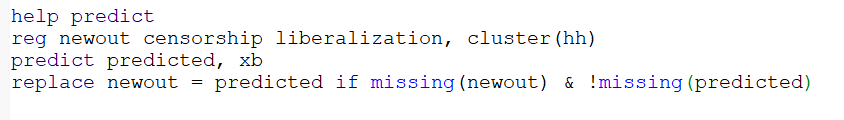

```{r setup, include=FALSE}
knitr::opts_chunk$set(echo = TRUE, eval=TRUE, warning=FALSE, message=FALSE)
```

# Today's plan
- Missing data, imputation, and multiple imputation
- Bounds on causal effects
- Limited dependent variables, marginal and causal effects


# Working example


# Baseline results (full data)
\tiny
```{r}
library(haven); library(estimatr); library(modelsummary); library(tidyverse); library(ggpubr)
d <- read_dta("Censorship.dta")

# Reproduce col 1 of table 1
mod <- lm_robust(ak_rating ~ censorship + liberalization, clusters = hh, se_type = "stata",
                 data = d)
modelsummary(mod, coef_omit = "Int", output = "markdown")

```

# Missing Completely at Random
\tiny
```{r}
set.seed(123)

nboot <- 500

cens <- lib <- rep(NA,nboot)

# 20% of outcome values are missing in the data
for (i in 1:nboot){
  d <- d %>% mutate(newout = ifelse(runif(nrow(d),0,1)<0.2, NA, ak_rating))
  fit <- update(mod, newout ~ .)
  cens[i] <- coef(fit)["censorship"]
  lib[i] <- coef(fit)["liberalization"]
}

plot1 <- ggplot(as.data.frame(cens)) + geom_density(aes(x=cens), col="red") +
  labs(x="Estimate", title = "Censorship") + 
  geom_vline(xintercept = mean(cens), col="red", linetype = "dashed") +
  geom_vline(xintercept = coef(mod)["censorship"], col="blue") + theme_bw()

plot2 <- ggplot(as.data.frame(lib)) + geom_density(aes(x=lib), col="dark green") +
  labs(x="Estimate", title = "Liberalization") + 
  geom_vline(xintercept = mean(lib), col="dark green", linetype = "dashed") +
  geom_vline(xintercept = coef(mod)["liberalization"], col="blue") + theme_bw()
```

# Missing Completely at Random
\tiny
```{r, fig.align="center", fig.height=5}
ggarrange(plot1, plot2)

```
\pause

With MCAR we are good


# Missing at Random
\tiny
```{r}

# Suppose during dictatorship people express negative attitudes by non-responding
set.seed(123)

nboot <- 500

cens <- lib <- rep(NA,nboot)

for (i in 1:nboot){
  d <- d %>% mutate(newout = ifelse(rnorm(nrow(d), mean = d$censorship)>1.15, 
                                    NA, ak_rating))
  fit <- update(mod, newout ~ .)
  cens[i] <- coef(fit)["censorship"]
  lib[i] <- coef(fit)["liberalization"]
}

plot1 <- ggplot(as.data.frame(cens)) + geom_density(aes(x=cens), col="red") +
  labs(x="Estimate", title = "Censorship") +
  geom_vline(xintercept = mean(cens), col="red", linetype = "dashed") +
  geom_vline(xintercept = coef(mod)["censorship"], col="blue") + theme_bw()

plot2 <- ggplot(as.data.frame(lib)) + geom_density(aes(x=lib), col="dark green") +
  labs(x="Estimate", title = "Liberalization") +
  geom_vline(xintercept = mean(lib), col="dark green", linetype = "dashed") +
  geom_vline(xintercept = coef(mod)["liberalization"], col="blue") + theme_bw()

```

# Missing at Random
\tiny
```{r, fig.align="center", fig.height=5}
ggarrange(plot1, plot2)
```

\pause
MAR is also fine if we missingness is random conditional on the model variables.


# Point identification with missingness
If MCAR, we don't need to worry, in expectation the estimates are unbiased

If MAR, we can use covariates that determine missingness to impute the missing values of the outcome 

# Imputation with regression
\tiny
```{r}
# Predicted values from the regression
d <- d %>% mutate(predicted = predict(fit, newdata = d))

# Replace missing outcomes with imputed values
d <- d %>% mutate(impy = ifelse(is.na(newout), predicted, newout))
```

In Stata you can use the post-estimation command `predict`




# Multiple imputation with MICE
\tiny
```{r}
library(mice)
m1 <- mice(data = zap_labels(d[,c("newout", "censorship", "liberalization",
                                  "sed", "education")]), 
           maxit = 5, printFlag = FALSE)
d_imp <- complete(m1)

length(d$newout[is.na(d$newout)])
length(d_imp$newout[is.na(d_imp$newout)])
```


# Bounds 
If we are not willing to make strong assumptions about the nature of the DGP to justify MAR, we can still estimate bounds on causal effects.

# Manski bounds
Also called the "worst case" bounds.

Idea: fill missing outcomes using the bounds of the potential outcomes to give extreme (smallest and largest) cases of the ATE

# Manski bounds
Formally:

$$
\begin{aligned}
\beta^L \leq ATE \leq \beta^H \\
\beta^L = \{\mu_{1,obs} Pr[R_{1i}=1] + {\color{blue}y_1^L} Pr[{\color{red}R_{1i=0}}]\} - \\
\{\mu_{0,obs}Pr[R_{0i}=1]+ {\color{blue}y_0^H}Pr[{\color{red}R_{0i}=0}]\} \\
\beta^H = \{\mu_{1,obs} Pr[R_{1i}=1] + {\color{blue}y_1^H} Pr[{\color{red}R_{1i=0}}]\} - \\
\{\mu_{0,obs}Pr[R_{0i}=1]+{\color{blue}y_0^L} Pr[{\color{red}R_{0i}=0}]\}
\end{aligned}
$$
$\{y_t^L, y_t^H\}$ are straightforward when the outcome is naturally bounded, e.g. binary (just replace every missing $y$ with 0 or 1). Otherwise, they are not. And if the bounds are very large, the set of possible effects can be so large to be practically meaningless.

# Manski bounds
Implementation:

- Manually
- A few packages in R: `ATbounds` [(vignette)](https://cran.r-project.org/web/packages/ATbounds/vignettes/ATbounds_vignette.pdf), `attrition` by Alex Coppock [(download from GitHub)](https://alexandercoppock.com/attrition/)

\tiny
```{r}
#install.packages("ATbounds")
#library(ATbounds)

#install.packages(devtools)
#library(devtools)
#install_github("acoppock/attrition")
```


# Lee bounds
Motivation: provide bounds on the causal effect even with unbounded outcome.

Trade-off: impose more structure on the data, but weaker than "exclusion restrictions" necessary for other strategies.

Relies on a monotonicity assumption similar to that used for LATE identification, but in this case it serves to solve sample selection.

# Lee bounds
Assumptions:

$$
\begin{aligned}
(Y_{1i}^*, Y_{0i}^*, R_{1i}, R_{0i}) \perp D  \\
R_{1i} \geq R_{0i}
\end{aligned}
$$

Under these assumptions, Lee (2009) proves that we can identify bounds for the ATE *for the sub-population* $\{R_{0i}=1, R_{1i}=1\}$.

$$
\begin{aligned}
\Delta_0^{LB} = E[Y|D=1, R=1, Y \leq y_{1-p0}] - E[Y|D=0, R=1] \\
\Delta_0^{UB} = E[Y|D=1, R=1, Y \geq y_{p0}] - E[Y|D=0, R=1]\\
p_0 = \frac{Pr[R=1|D=1] - Pr[R=1|D=0]}{Pr[R=1|D=1]}
\end{aligned}
$$


# Lee bounds
Implementation:

- R: `leebounds` (install_github("vsemenova/leebounds"))
- Stata: `leebounds`

# Lee bounds
\tiny
```{r}
library(leebounds)

input <- d %>% mutate(sel = ifelse(is.na(newout),0,1)) %>% 
  select(c(censorship, newout, sel)) %>%
  rename(treat = censorship, outcome = newout, selection = sel)

do.call("rbind", leebounds(input))
```