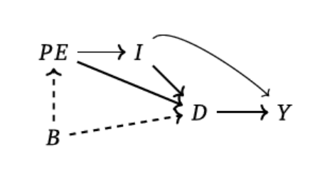
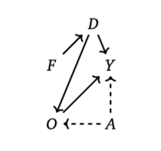
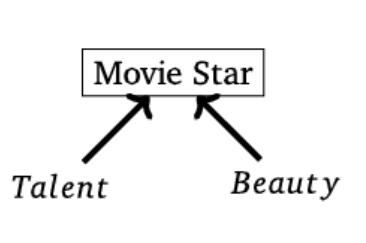

```{r setup, include=FALSE}
knitr::opts_chunk$set(echo = TRUE, eval=TRUE, warning=FALSE, message=FALSE)
```


# Today's plan
- DAGs 
- Regression 
- Heterogeneity and effective samples
- Running regressions in practice

# Conditioning in DAGs
Conditioning on some variable $w$ in a DAG is equivalent to do the following steps:

- If $w$ is a collider, link all pairs of parents of $w$ by drawing an undirected edge between them
- For any ancestor of $w$, if this ancestor is itself a collider, link all pairs of parents of this ancestor with undirected edges to connote induced dependencies
- Erase $w$ from the graph and all the edges connected with $w$


# DAGs
An example from the Mixtape



# DAG simulations
- Let's see these properties at work, with some simulations
- Examples and code from The Mixtape, (pp. 108-113)

Case 1: the effect of gender discrimination on women income


# DAG simulations
\tiny
```{r}
library(tidyverse)
library(stargazer)

# Set seed
set.seed(123)

# Simulate our data
tb <- tibble(
  female = ifelse(runif(10000) >= 0.5, 1, 0),
  ability = rnorm(10000),
  discrimination = female,
  occupation = 1 + 2*ability + 0*female - 2*discrimination + rnorm(10000),
  wage = 1-1*discrimination + 1*occupation + 2*ability + rnorm(10000)
)

# Estimate regressions 
lm_1 <- lm(wage ~ female, tb)
lm_2 <- lm(wage ~ female + occupation, tb)
lm_3 <- lm(wage ~ female + occupation + ability, tb)

```
# DAG simulations
\tiny
```{r}
# Compare
stargazer(lm_1, lm_2, lm_3, type = "text",
          column.labels = c("Biased unconditional",
                            "Biased",
                            "Unbiased Conditional"))

```


# DAG simulations
Case 2: Talent and beauty



# DAG simulations

\tiny
```{r}
library(tidyverse)

# Set seed 
set.seed(3444)

# Simulate data
star_is_born <- tibble(
  beauty = rnorm(2500),
  talent = rnorm(2500),
  score = beauty + talent,
  c85 = quantile(score, .85),
  star = ifelse(score >= c85, 1, 0)
)

```


# DAG simulations

\tiny
```{r, fig.height = 2.7, fig.width = 4}
star_is_born %>% 
  lm(beauty ~ talent, .) %>%
  ggplot(aes(x = talent, y = beauty)) +
  geom_point(size = 0.5, shape = 23) + xlim(-4, 4) + ylim(-4, 4) +
  theme_bw()
  
```

# DAG simulations

\tiny
```{r, fig.height = 2.7, fig.width = 4}

star_is_born %>% 
  filter(star == 1) %>% lm(beauty ~ talent, .) %>%
  ggplot(aes(x = talent, y = beauty)) +
  geom_point(size = 0.5, shape = 23) + xlim(-4, 4) + ylim(-4, 4) +
  theme_bw()
  
```

# Conclusion
- Don't control for/condition on colliders
- Endogenous sample selection is a form of collider bias!
  - See discussion in Knox et al (2020) on admin data

Additional resources:

- [Elwert and Winship (2014), Endogenous selection bias: the problem of conditioning on a collider variable](https://www.annualreviews.org/doi/pdf/10.1146/annurev-soc-071913-043455)
- [Knox, Lucas, and Cho (2022), Testing causal theories with learned proxies](https://dcknox.github.io/files/KnoxLucasCho_CausalTheoriesLearnedProxies.pdf)
- [Schneider (2020), Collider bias in economic history research](https://www.sciencedirect.com/science/article/abs/pii/S0014498320300516)


# Frisch-Waugh-Lovell theorem: a refresher
- We have a linear model with $K$ covariates. In matrix form: $y = X'\beta + \epsilon$
- FWL gives a formula for the OLS estimate of the $k^{th}$ coefficient.

$$
\hat{\beta}_k = (X'_{k}M_{[X_{-k}]}X_{k})^{-1}X'_{k}M_{[X_{-k}]}y
$$

- In other words we can do the following: 
  - Regress the individual variable $X_k$ on all the other covariates and take the residuals
  - Regress the outcome variable $y$ on all the covariates, except $X_k$, and take the residuals
  - Regress the residuals of $y$ on the residuals for $X$
- Note that to get $\hat{\beta}_k$ it is enough to regress the non-residualized $y$ on residualized $X_k$ (because the matrix $M$ is idempotent), but the SE won't be right
- Useful because typically we are interested in just one regressor (e.g. a treatment indicator), so we can reduce the dimensionality of the model

# FWL in practice
\tiny
```{r}
# Import a dataset
data("mtcars")

# Multivariate regression
fit <- lm(mpg ~ cyl + drat + wt, mtcars)

# FWL
resy <- lm(mpg ~ drat + wt, mtcars) %>% residuals()
resx <- lm(cyl ~ drat + wt, mtcars) %>% residuals()
fit2 <- lm(resy ~ resx)

# Compare results
out <- c(coefficients(fit)["cyl"], coefficients(fit2)["resx"])
names(out) <- c("Multivariate", "Univariate Residualized")
out

```

# FWL in practice
With residual-residual plots we can show the relationship between two variables while "controlling" for the others

\tiny 
```{r, fig.height=2, fig.width=3, fig.align="center"}
as.data.frame(cbind(resy, resx)) %>% rename(mpg_res = resy, cyl_res = resx) %>%
  ggplot(aes(x=cyl_res, y=mpg_res)) + geom_point(size=1.5, colour="black", shape=21) +
  geom_smooth(method="lm") + 
  labs(x = "Cyl, res.", y = "MPG, res.") + theme_bw()
```

# Heterogeneous treatment effects
With heterogeneous treatment effects, OLS estimators have some features to be aware of

- Two groups in the population, A and B. Represented by covariate $X_i \in \{A,B\}$. We draw a random sample. We want to estimate the ATT.
- There is treatment effect heterogeneity by group: $ATT_A \neq ATT_B$. CIA holds: $(Y_{0i}, Y_{1i}) \bot D_i | X_i$
- CIA intuitively means we can do the following:
  1. Fix a value of $X_i$
  2. Estimate the effect of $D$ on $Y$ for units with that value of $X_i$. This is a causal estimate
  3. Repeat for all values of $X_i$
  4. Aggregate all these causal estimates: a weighted average


# Heterogeneous treatment effects
Call $\alpha_A$ the share of units in group A among the treated in the population, and $\alpha_B$ the share of units in group B. Then,

$$
\begin{aligned}
& ATT = \alpha_A*ATT_A + \alpha_B*ATT_B \\
& \alpha_A + \alpha_B = 1
\end{aligned}
$$
We can rewrite as:
$$
\begin{aligned}
& ATT = {\color{red} \alpha_A}*ATT_A + {\color{red} \alpha_B}*ATT_B \\
& ATT = {\color{red} P(X_i = A|D_i = 1)} \{E[Y_{1i} - Y_{0i}|X_i=A, D_i=1]\} + \\ & 
{\color{red} P(X_i = B|D_i = 1)}\{E[Y_{1i} - Y_{0i}|X_i=B, D_i=1]\} 
\end{aligned}
$$
The terms in red are the weights we use in the weighted average: the share of units with the same ATT.

By CIA, the terms in black are identified. So we can estimate ATT with sample analogues.

# Heterogeneous treatment effects
An unbiased estimator is 
$$
\hat{ATT} = \frac{\sum_{x\in\{A,B\}} \hat{\delta}_X 
\hat{P}(D_i=1|X_i=x) \hat{P}(X_i=x)}{\sum_{x\in\{A,B\}}\hat{P}(D_i=1|X_i=x) \hat{P}(X_i=x)}
$$
OLS regression also estimates a weighted average of individual-unit treatment effects (proof in lecture slides and MHE) 

$$
\hat{ATT_R} = \frac{\sum_{x\in\{A,B\}} \hat{\delta}_X
\hat{P}(D_i=1|X_i=x)(1 - \hat{P}(D_i=1|X_i=x))\hat{P}(X_i=x)}{\sum_{x\in\{A,B\}}\hat{P}(D_i=1|X_i=x)(1-\hat{P}(D_i=1|X_i=x)) \hat{P}(X_i=x)}
$$
This is not the weighted average we have started with: instead of weighting more the group that represents more units, it weights more the group where the treatment status has higher variance.

How distributed the treatment needs to be in a group in order for it to have the highest weight?

# Effective sample
- Aronow and Samii (2016) show that under some assumptions about the functional form of the treatment assignment the following result holds:

$$
\hat{\beta}\,{\buildrel p \over \to}\,\frac{E[w_i \tau_i]}{E[w_i]} \text{, where } w_i = (D_i - E[D_i|X_i])^2 
$$
so that 
$$
E[w_i|X_i] = E[ D_i - E[D_i|X_i]|X_i]^2 = Var[D_i|X_i]
$$

- This result implies that regression re-weights units in ways that are not detectable at first sight
- Units in groups/Covariates strata where the treatment has a higher conditional variance receive more weight
- Equivalent to run the regression on an *effective* sample different from the one we think we are working with
- To characterize the effective sample we can estimate the $w_i$s

# Effective sample
Let's rewrite the last expression.
$$
E[w_i|X_i] = E[{\color{blue} (D_i - E[D_i|X_i]|X_i)}^2] = Var[D_i|X_i]
$$

- If we assume linearity of the treatment assignment in $X_i$, the weight is equal to the square of the residual of regressing the treatment indicator on $X_i$
- Intuition: higher conditional variance of treatment $\implies$ treatment has more residual variance not explained by the covariates $\implies$ higher error term
- The regression exploits as much as possible this identifying variation
- We can estimate the regression weights by the following procedure:
  1. Run the regression $D_i = X_i\gamma + e_i$
  2. Take residual $\hat{\epsilon}_i = D_i - X_i \hat{\gamma}$ and square it
  
# Effective sample: example
- Let's study the effective sample in an actual paper
- Egan and Mullin (2012) look at how people form their attitudes based on personal experiences
- They use local weather variation to estimate the effect of experiencing weather changes on beliefs about global warming  
- To understand the effective sample, we need to ask where weather is most variable (conditional on covariates)

# Effective sample: example
\footnotesize
```{r}
# Import the data
library(haven)
d <- read_dta("gwdataset.dta")

# Import state IDs
zips <- read_dta("zipcodetostate.dta")
zips <- zips %>% select(c(statenum, statefromzipfile)) %>% unique()
zips <- zips %>% filter(!(statenum == 8 & statefromzipfile == "NY"))

# Import population data
pops <- read.csv("population_ests_2013.csv")

# Format
pops$state <- tolower(pops$NAME)
d$getwarmord <- as.double(d$getwarmord)
```


# Effective sample: example
\footnotesize
```{r}
# Estimate primary model of interest:
d$doi <- factor(d$doi)
d$statenum <- factor(d$statenum)
d$wbnid_num <- factor(d$wbnid_num)
Y <- "getwarmord"
D <- "ddt_week"
X <- names(d)[c(15,17,42:72)]
reg_formula <- paste0(Y, "~", D, "+", paste0(X, collapse = "+"))
reg_out <- lm(as.formula(reg_formula), d)

# Or
out <- lm(getwarmord~ddt_week+educ_hsless+educ_coll+educ_postgrad+
          educ_dk+party_rep+party_leanrep+party_leandem+
          party_dem+male+raceeth_black+raceeth_hisp+
          raceeth_notwbh+raceeth_dkref+age_1824+age_2534+
          age_3544+age_5564+age_65plus+age_dk+ideo_vcons+
          ideo_conservative+ideo_liberal+ideo_vlib+ideo_dk+
          attend_1+attend_2+attend_3+attend_5+attend_6+
          attend_9+as.factor(doi)+as.factor(statenum)+
          as.factor(wbnid_num),d)


```

# Base Model
\footnotesize
```{r}
summary(reg_out)$coefficients[1:10,]
```

# Estimate the weights
\footnotesize
```{r}
# Regress treatment indicator on the vector of covariates
D_formula <- paste0(D, "~", paste0(X, collapse = "+"))
outD <- lm(as.formula(D_formula),d)

# Extract the residuals and take their square
eD2 <- residuals(outD)^2
```

# Effective sample statistics
- We can use these estimated weights to study the effective sample

\footnotesize
```{r}
# Take some relevant variables
compare_samples<- d[, c("wave", "ddt_week", "ddt_twoweeks",
  "ddt_threeweeks", "party_rep", "attend_1", "ideo_conservative",
  "age_1824", "educ_hsless")]

# Compute statistics with and without weights
compare_samples <- t(apply(compare_samples,2,function(x) 
  c(mean(x),sd(x),weighted.mean(x,eD2),
    sqrt(weighted.mean((x-weighted.mean(x,eD2))^2,eD2)))))
colnames(compare_samples) <- c("Nominal Mean", "Nominal SD",
      "Effective Mean", "Effective SD")
```

# Effective Sample Statistics
\scriptsize
```{r}
compare_samples
```

# Effective sample maps
- We can depict the samples visually
- What places in the US are "over-represented" in the effective samples?


# Effective sample maps
\footnotesize
```{r}
# Construct the "effective sample weights" for each state
wts_by_state <- tapply(eD2, d$statenum, sum)
wts_by_state <- wts_by_state/sum(wts_by_state)*100
wts_by_state <- data.frame(eff = wts_by_state, 
                           statenum = as.numeric(names(wts_by_state)))

# Merge to the state name variable
data_for_map <- merge(wts_by_state, zips, by="statenum")

# Construct the "nominal sample weights" for each state
wts_by_state <- tapply(rep(1,6726),d$statenum,sum)
wts_by_state <- wts_by_state/sum(wts_by_state)*100
wts_by_state <- data.frame(nom = wts_by_state, 
                           statenum = as.numeric(names(wts_by_state)))

# Add to the other data
data_for_map <- merge(data_for_map, wts_by_state, by="statenum")
```

# Effective sample maps
\tiny
```{r}
# Get correct state names
require(maps,quietly=TRUE)
data(state.fips)

# Add them to the dataset
data_for_map <- left_join(data_for_map, state.fips,
                          by = c("statefromzipfile" = "abb"))

# More data prep
data_for_map$state <- sapply(as.character(data_for_map$polyname),
                             function(x)strsplit(x,":")[[1]][1])
data_for_map <- data_for_map %>% group_by(statefromzipfile) %>%
  summarise_all(first) %>% ungroup() %>% select(-polyname)

# Diff between nominal and effective weights
data_for_map$diff <- data_for_map$eff - data_for_map$nom

# Merge with population data
data_for_map <- left_join(data_for_map, pops, by="state")

# Actual "weight" of each state in the US
data_for_map$pop_pct <- data_for_map$POPESTIMATE2013/sum(
  data_for_map$POPESTIMATE2013)*100

# Different representativity of the two samples
data_for_map <- mutate(data_for_map,
                       pop_diff_eff = eff - pop_pct,
                       pop_diff_nom = nom - pop_pct)
data_for_map <- mutate(data_for_map, 
                       pop_diff = pop_diff_eff - pop_diff_nom)

require(ggplot2,quietly=TRUE)
state_map <- map_data("state")
```

# More setup
\tiny
```{r}
# Plot the weights in each sample
plot_eff <- ggplot(data_for_map, aes(map_id = state)) +
  geom_map(aes(fill=eff), map = state_map) +
  expand_limits(x= state_map$long, y = state_map$lat) +
  scale_fill_continuous("% Weight", limits=c(0,17), low="white", high="black") +
  labs(title = "Effective Sample") +
  theme(legend.position=c(.2,.1),legend.direction = "horizontal",
        axis.line = element_blank(), axis.text = element_blank(),
        axis.ticks = element_blank(), axis.title = element_blank(),
        panel.background = element_blank(), 
        plot.background = element_blank(),
        panel.border = element_blank(), 
        panel.grid = element_blank())


plot_nom <- ggplot(data_for_map, aes(map_id = state)) +
  geom_map(aes(fill=nom), map = state_map) +
  expand_limits(x=state_map$long, y=state_map$lat) +
  scale_fill_continuous("% Weight", limits=c(0,17), low="white", high="black") + 
  labs(title="Nominal Sample") +
  theme(legend.position=c(.2,.1),legend.direction = "horizontal",
        axis.line = element_blank(), axis.text = element_blank(),
        axis.ticks = element_blank(), axis.title = element_blank(),
        panel.background = element_blank(), 
        plot.background = element_blank(),
        panel.border = element_blank(), panel.grid = element_blank())


```

# Maps
\footnotesize
```{r, fig.cap='',fig.height=3,fig.width=7, fig.align="center"}
require(gridExtra,quietly=TRUE)
grid.arrange(plot_nom,plot_eff,ncol=2)
```

# Setup comparison plot
\footnotesize
```{r}
plot_diff <- ggplot(data_for_map,aes(map_id=state)) +
  geom_map(aes(fill=diff), map = state_map) +
  expand_limits(x = state_map$long, y = state_map$lat) +
  scale_fill_gradient2("% Weight", low = "red", mid = "white", high = "black") +
  labs(title = "Effective Weight minus Nominal Weight") +
  theme(legend.position=c(.2,.1),legend.direction = "horizontal",
        axis.line = element_blank(), axis.text = element_blank(), 
        axis.ticks = element_blank(), axis.title = element_blank(),
        panel.background = element_blank(), 
        plot.background = element_blank(),
        panel.border = element_blank(), panel.grid = element_blank())

```

# Difference in weights
\tiny
```{r,fig.cap='',fig.height=2.8,fig.width=3.8, fig.align="center"}
plot_diff
```

# Linear regression in practice
- In `R` the command `lm()` implements the OLS estimation
- Now a variety of packages handle robust SEs and FEs much better (more on this in the coming weeks)
  - `estimatr::lm_robust()`. Good for design of randomized experiments
  - `fixest::feols()`. Good for panel data with many FEs
  - `lfe::felm()`. Once popular for panel data, now on the way to be abandoned
- Stata: `reg[ress]`. Better default than `lm()` but also superseded in contemporary empirical research
  - `xtreg`, `areg`, `reghdfe` all used in empirical research due to the handling of FEs, the latter seems to be taking over
- Packages to export output in tables: `stargazer`, `modelsummary`
- In Stata: `outreg2`, `estout`