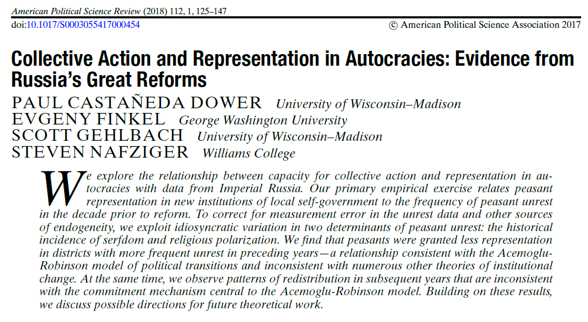
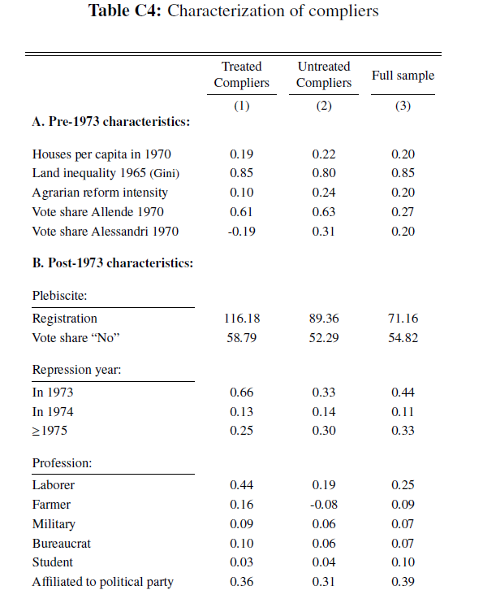

```{r setup, include=FALSE}
knitr::opts_chunk$set(echo = TRUE, eval=TRUE, warning=FALSE, message=FALSE)
```


# Today's plan
- HW2 review
- Inference and standard errors
- Instrumental Variables

# Housekeeping
- Deadlines
- Data for HW3

# Homework 2


# Preamble: plug-in estimation
A general principle for estimating theoretical properties of distributions, e.g. moments (cf. Aronow and Miller (2019), sec.3.3)

*Plug-in principle*:  We want to estimate some parameter ${\color{red}\theta} = T({\color{red}F})$, where ${\color{red}F}$ is a CDF and $T: \mathcal{F} \to \mathbb{R}$ is a functional mapping CDFs into real numbers. A plug-in estimator for $\theta$ is ${\color{blue}\hat{\theta}} = T({\color{blue}\hat{F}})$, where ${\color{blue}\hat{F}}$ is an empirical CDF. 

Under some regularity conditions of $T$, $\hat{\theta} = T(\hat{F})$ has desirable properties such as asymptotic normality.

# Basics of inference: a friendly review
- We estimate some theoretically interesting quantity, we want to know how far we may be from the true value
- Population quantity estimated from random sample (e.g. E(X), PATE) or sample quantity estimated from random assignment (e.g. SATE)
- "Uncertainty" of our estimate depends on the sampling distribution of our estimator, in particular on its sampling standard deviation (the standard error), which we don't know
- For instance, if we know that $X\sim N(\mu, \sigma^2)$, then we know that $\bar{x}\sim N(\mu, \frac{\sigma^2}{n})$ always
- If we don't know the actual distribution of our variables, we usually can't rely on analytical derivations of the sampling distribution \pause
  - Use asymptotic approximations using familiar results
  - Impose distributional assumptions 
  
# Basics of inference: a friendly review
Aronow and Miller (2019), p.125

A valid confidence interval for a parameter $\theta$ with coverage $(1-\alpha)$ is a random interval $CI_{(1-\alpha)}(\theta)$ such that $P[\theta \in CI_{(1-\alpha)}(\theta)] \geq 1-\alpha$

An ${\color{blue}\text{asymptotically}}$ valid confidence interval is one such that ${\color{blue}\lim_{n \to -\infty}}  P[\theta \in CI_{(1-\alpha)}(\theta)] \geq 1-\alpha$

If our estimator $\hat{\theta}$ has an asymptotically normal distribution and $\hat{V}(\hat{\theta})$ is consistent for $V(\hat{\theta})$, then an asymptotically valid confidence interval for $\hat{\theta}$ is: 

$$CI_{(1-\alpha)}(\theta) = [\hat{\theta} - z_{(1-\frac{\alpha}{2})}\sqrt{\hat{V}(\hat{\theta})}, \hat{\theta} + z_{(1-\frac{\alpha}{2})}\sqrt{\hat{V}(\hat{\theta})}] $$
An application of the plug-in principle: if $\hat{V}(\hat{\theta}) \to V(\theta)$, $Z' = \biggl(\frac{\hat{\theta} - \theta}{\sqrt{\hat{V}(\hat{\theta})}}\biggr) \to Z = \biggl(\frac{\hat{\theta} - \theta}{\sqrt{V(\hat{\theta})}}\biggr) \sim N(0,1)$.


# Example: normal approximations for confidence intervals
\tiny
```{r}
library(ggplot2)
set.seed(123)

# Number of confidence intervals
tot <- 100

s1 <- s2 <- s3 <- matrix(NA, tot, 2)

confint <- function(x, alpha){
  est <- mean(x)
  lower <- est - qnorm(1-alpha/2)*(sd(x)/sqrt(length(x)))
  upper <- est + qnorm(1-alpha/2)*(sd(x)/sqrt(length(x)))
  c(lower, upper)
}

for (i in 1:tot){
  s1[i,] <- confint(rnorm(30, mean = 0.5), 0.05)
  s2[i,] <- confint(rpois(30, 0.5), 0.05)
  s3[i,] <- confint(rpois(100, 0.5), 0.05)
}

plot <- function(m){
  require(dplyr)
  plot <- m %>% as.data.frame() %>% mutate(id = c(1:dim(m)[1])) %>%
    ggplot(aes(x=id, col=ifelse(V1<=0.5 & V2>=0.5, 1, 0))) + geom_errorbar(aes(ymin = V1, ymax = V2)) + 
    geom_hline(yintercept = 0.5, linetype = "dashed") + theme_void() + theme(legend.position = "none")
  plot
}


```

# Example: normal approximation for confidence intervals
\tiny
```{r, fig.align='center', fig.height=3.5}
library(ggpubr)
ggarrange(plot(s1), plot(s2), plot(s3), ncol = 3, 
          labels = list("Normal, small N", "Non-normal, small N", "Non-normal, large N"))

```

# Standard errors for causal effects
Imagine a randomized experiment where the PATE is our target. Our estimator is the difference in means $\hat{\tau} = \bar{Y}_1 - \bar{Y}_0$.

We have seen that the Neyman estimator is an unbiased estimator for the variance of $\hat{\tau}$ under sampling and randomization distribution:

$$\hat{V}_{ney} = \frac{\hat{s}^2_{Y_1}}{n_1} + \frac{\hat{s}^2_{Y_0}}{n_0}$$
Therefore we can use the Neyman standard error $\sqrt{\hat{V}_{ney}}$ to construct confidence intervals around $\hat{\tau}$ and test hypotheses about $\hat{\tau}_{PATE}$

# Equivalence of Neyman SE and robust regression SE
The formulation of the Neyman estimator provides an intuitive rational for heteroskedasticity-robust SEs: it allows outcome variance to vary with levels of treatment (the definition of heteroskedasticity).

Indeed, the "HC2" estimator for robust regression SEs is equivalent to it.

To see this, let's use `estimatr`, a package for the analysis of randomized experiments, where HC2 is the default.

# Equivalence of Neyman SE and robust regression SE
\tiny
```{r}
## Simulate a randomized experiment
set.seed(123)
library(estimatr)

# Simulated population
pop <- data.frame(Y1 = rnorm(1000, 4, 2), Y0 = rnorm(1000, 0.5, 3))

# Random sample
sample <- pop[sample(nrow(pop), 100),]
sample$D <- 0
sample$D[sample(100, 30)] <- 1

# Observed potential outcomes
sample <- sample %>% mutate(Y = D*Y1 + (1-D)*Y0)

# Compute the Neyman SE manually
(ney_se <- sqrt(var((sample$Y[sample$D==1]))/sum(sample$D==1) + var((sample$Y[sample$D==0]))/sum(sample$D==0)))

# Regression with HC2 robust SE
lm_robust(Y ~ D, data = sample)

# Note this is different from HC1 (the Stata default)
lm_robust(Y ~ D, data = sample, se_type = "stata")

```

# Robust variance estimators for the Difference in Means
See Imbens and Rubin Ch.7 and MHE Ch.8 (be aware of notation)

$\hat{s}^2_{Y_j} = \frac{\sum_{i:D_i=j}^{N_j}(Y_i - \bar{Y}_j)^2}{n_j-1}$

- Non-robust/conventional: $\hat{s}^2_Y(\frac{1}{n_1} + \frac{1}{n_0})$
- HC0: $\frac{n_0 -1}{n_0^2}\hat{s}_{Y_0}^2 + \frac{n_1 -1}{n_1^2}\hat{s}_{Y_1}^2$
- HC1: $\frac{n}{n-2}\biggl(\frac{n_0 -1}{n_0^2}\hat{s}_{Y_0}^2 + \frac{n_1 -1}{n_1^2}\hat{s}_{Y_1}^2\biggr)$
- HC2: $\frac{\hat{s}^2_{Y_1}}{n_1} + \frac{\hat{s}^2_{Y_0}}{n_0}$
- HC3: $\frac{\hat{s}^2_{Y_1}}{n_1-1} + \frac{\hat{s}^2_{Y_0}}{n_0-1}$

# Robust variance estimators in regression
In multivariate regression, the problem generalizes to the estimation of a covariance *matrix* for the vector of OLS coefficients.

The general form of a sampling variance estimator for the OLS vector  $\mathbf{\hat{\beta}}$ is
$$\hat{V}(\hat{\mathbf{\beta}}) = (X'X)^{-1}X'\hat{\Psi}X(X'X)^{-1}$$
where $\hat{\Psi}$ is an estimator of $plim [\epsilon\epsilon']$. Estimators differ in what goes in the diagonal of $\hat{\Psi}$.

# Robust variance estimators in regression
From MHE, Ch.8.

- Non-robust/conventional: $\hat{\psi}_i = \hat{\psi} = \frac{\sum_{i=1}^ne_i^2}{n-k} = \hat{\sigma}$
- HC0: $\hat{\psi}_i = \hat{e}_i^2$
- HC1: $\hat{\psi}_i = \frac{n}{n-k}\hat{e_i}^2$
- HC2: $\hat{\psi} = \frac{1}{1-h_{ii}}\hat{e}_i^2$
- HC3: $\hat{\psi} = \frac{1}{(1-h_{ii})^2}\hat{e}_i^2$

# Robust standard errors in R
\tiny
```{r}
# lm + lmtest + sandwich
library(sandwich); library(lmtest)
fit <- lm(Y ~ D, data = sample)
coeftest(fit, vcov = vcovHC(fit, type = "HC2"))
```

# Robust standard errors in R
\tiny
```{r}
# Manual (only the conventional case)
summary(fit)

N <- nrow(sample)
D <- cbind(rep(1, N), sample$D)
K <- dim(D)[2]
           
vcov <- solve((t(D) %*% D)) %*% t(D) %*% diag((sum(residuals(fit)^2)/(N-K)), N, N) %*% D %*% solve((t(D) %*% D))

cbind(coef(fit), sqrt(diag(vcov)))
```

# Robust standard errors in R and Stata
- Some packages like `estimatr` or `fixest` have built-in options for various types of robust SEs
- Like `lm`, other packages only provide the default homoskedastic SEs, so you have to call a post-estimation command that computes the robust covariance matrix
- Looks annoying if you come from Stata
- **always** check the `help` material to see what SEs are computed
- In Stata: `regress y x, vce()`, the argument of `vce()` can be `robust`, `hc2`, `hc3`, `bootstrat`, `cluster clustervar` 
- If you replicate analyses in another language, cross-check the documentation, as different adjustments may be applied (see below for IV)

# Bootstrap standard errors in R and Stata
- In R: check the `boot` package and `car::Boot()`. More in [this article](https://socialsciences.mcmaster.ca/jfox/Books/Companion/appendices/Appendix-Bootstrapping.pdf)
- If you are skilled coders you can write your own bootstrap function for regression (just be very careful)
- Cluster bootstrap SEs: check R's `fwildclusterboot` and Stata's `boottest`
  - Note they don't produce confidence intervals, only the p-values
- **Important**: since bootstrap randomizes, set seed or check what your package is doing

# Instrumental Variables
Principal Strata:

- Compliers: $D(1) = 1, D(0) = 0$
- Always-takers $D(1) = D(0) = 1$
- Never-takers $D(1) = D(0) = 0$
- Defiers: $D(1) = 0, D(0) = 1$


# IV in practice: Dower et al (2018)


# The effect of peasant unrest on representation
\tiny
```{r}
library(haven); library(AER); library(stargazer)
data <- read_dta("DFGN_cleaned.dta")

## OLS
olsfit <- lm(peasantrepresentation_1864 ~ afreq + distance_moscow + goodsoil + lnurban + lnpopn + province_capital, data)

## IV (1): serfdom
ivfit1 <- ivreg(peasantrepresentation_1864 ~ afreq + distance_moscow + 
                  goodsoil + lnurban + lnpopn + province_capital | serfperc1 +
                  distance_moscow + goodsoil + lnurban + lnpopn +
                  province_capital, data=data)

## IV (2): religious polarization
ivfit2 <- ivreg(peasantrepresentation_1864 ~ afreq + distance_moscow + 
                  goodsoil + lnurban + lnpopn + province_capital | religpolarf4_1870 + 
                  distance_moscow + goodsoil + lnurban + lnpopn + province_capital, data=data)

mod <- list(olsfit, ivfit1, ivfit2)
ses <- lapply(mod, function(x) coeftest(x, vcov = vcovHC(x, type = "HC1"))[,"Std. Error"])
labs <- c("", "Z: % serfs", "Z: religious pol.")

```

# The effect of peasant unrest on representation
\tiny
```{r}
stargazer(mod, se = ses, column.labels = labs, omit.stat = c("f", "ser"), type = "text")

```

# Characterize the compliers
There are different strategies: see the discussion in [Marbach and Hangartner (2020)](https://www.cambridge.org/core/journals/political-analysis/article/profiling-compliers-and-noncompliers-for-instrumentalvariable-analysis/0E2AA51F9BD436A5DB5A84462732A9C3).

Let's go through a regression-based alternative to k-weights, also based on Abadie.

Call $X$ a variable for which we want to know the mean among the treated compliers. $D$ is the endogenous treatment and $Z$ the instrument. Create $X^* = X*D$ and use it as outcome in the 2SLS model. The coefficient of $D$ instrumented is the mean of $Z$ among the treated compliers.

Use $X*(1-D)$ and replace $D$ with $1-D$ in the regression to do the same for the untreated compliers.

# Characterize the unrest compliers
\tiny
```{r}
# Variables used in the analysis
vars <- c("mliteracy_1897", "lingfrac_1897", "popdens1858",
          "percnobleown_1877", "districtfemale_1863")
exvars <- c("distance_moscow", "goodsoil", "lnurban", 
            "lnpopn", "province_capital")

# For simplicity, we collapse D and Z to a binary variable
data$D <- ifelse(data$afreq >= quantile(data$afreq, probs = 0.75, na.rm = T), 1, 0)
data$Z1 <- ifelse(data$serfperc1 >= quantile(data$serfperc1, 0.75, na.rm=T), 1, 0)
data$Z2 <- ifelse(data$religpolarf4_1870 >= quantile(data$religpolarf4_1870, 0.75, na.rm=T), 1, 0)


```


# Characterize the unrest compliers
\tiny
```{r}
##  Compliers' distribution, regression method
mean_comp <- function(var, Z){
  require(AER); require(dplyr)
  data <- mutate(data, Xc = get(var)*D)
  formula <- paste0("Xc", "~", "D", "+", paste(exvars, collapse = " + "),
                    "|", Z, "+", paste(exvars, collapse = " + "))
  fit <- ivreg(as.formula(formula), data=data)
  return(coef(fit)["D"])
}

means_z1_t <- means_z2_t <- rep(NA, length(vars))

# Population distribution
means_full <- round(apply(data[data$zemstvo==1,vars], 2, function(x) mean(x, na.rm=T)), 3)

# Compliers of % serf
for(i in 1:length(vars)){means_z1_t[i] <- round(mean_comp(vars[i], "Z1"), 3)}

# Compliers of rel. pol.
for(i in 1:length(vars)){means_z2_t[i] <- round(mean_comp(vars[i], "Z2"), 3)}


```

# Characterize the unrest compliers
\footnotesize
```{r}
cbind(means_full, means_z1_t, means_z2_t)
```

# Another example: Bautista et al (2020)


# Characterize repression compliers


# IV in R and Stata
R:

- `AER::ivreg` is the classic function
- `lfe::felm` and `fixest::feols` have built-in options for IV

Stata:

- `ivregress` is the classic function
- `ivreg2` user-written function with more estimators
- `xtivreg` and `ivreghdfe` are versions thought for panel data

As usual, check the documentation to make sure you understand what's going on (e.g. different standard error corrections)

# Profile compliers in R: ivdesc


# Double-robust estimator and IV
Remember the Double-Robust estimator:

$$
\begin{aligned}
\hat{\tau}_{dr} = \frac{1}{N} \sum_{i=1}^N\left(\frac{D_iY_i}{\hat{e}(X_i)} - \frac{\hat{Y}_{1i}(D_i - \hat{e}(X_i))}{\hat{e}{(X_i)}}\right) - \\ \frac{1}{N}\sum_{i=1}^N\left(\frac{(1-D_i)Y_i}{1 - \hat{e}(X_i)} +\frac{\hat{Y}_{0i}(D_i - \hat{e}(X_i))}{1-\hat{e}{(X_i)}} \right) = \\
= \frac{1}{N} \sum_{i=1}^N\left(\hat{Y}_{1i} - \frac{D_i(Y_i - \hat{Y}_{1i})}{\hat{e}(X_i)}\right) - \\
\frac{1}{N} \sum_{i=1}^N\left(\hat{Y}_{0i} - \frac{(1-D_i)(Y_i - \hat{Y}_{0i})}{1-\hat{e}(X_i)}\right)
\end{aligned}
$$
Consistent if either the specification for PS or CEF is correct. Intuition: we are correcting bias in the error of one model with an orthogonal model.

# Double-robust estimator and IV
Intuition: construct DR estimators for IV. \pause

$$\hat{\tau}_{wald} = \frac{\hat{E}[Y_i|Z=1] - \hat{E}[Y_i|Z=0]}{\hat{E}[D_i|Z=1] - \hat{E}[D_i|Z=0]}$$
Both the numerator (ITT/RF) and the denominator (1S) are Differences-in-means which identify causal effects, with a common treatment $Z$. 

One can build DR estimators for both and, if the estimated PS function for the instrument $Z$ is correctly specified, have consistency in both. Then, the ratio is consistent too (e.g. Slutsky theorem)