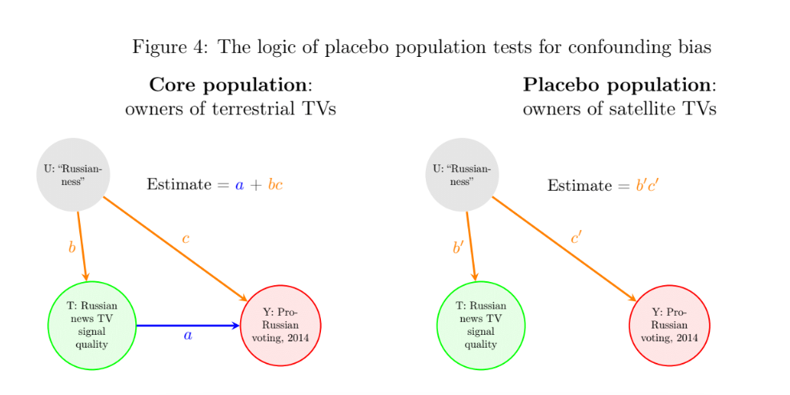
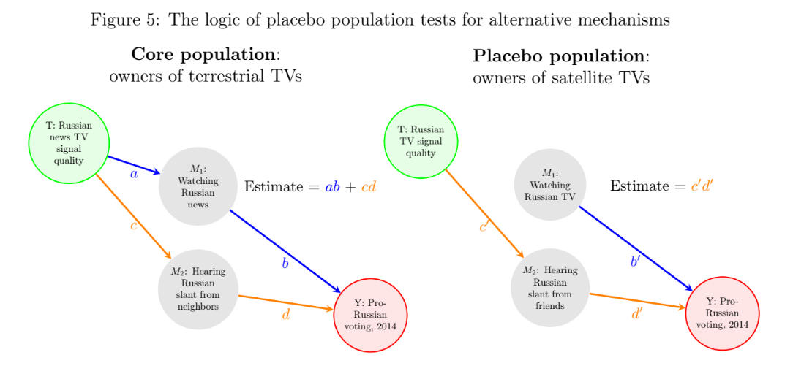
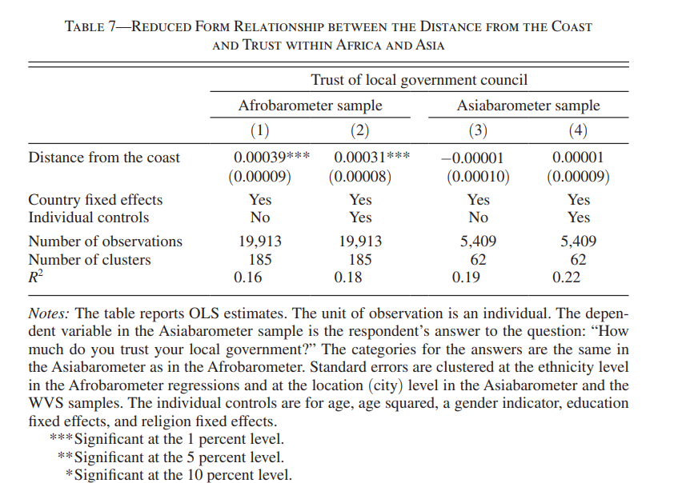
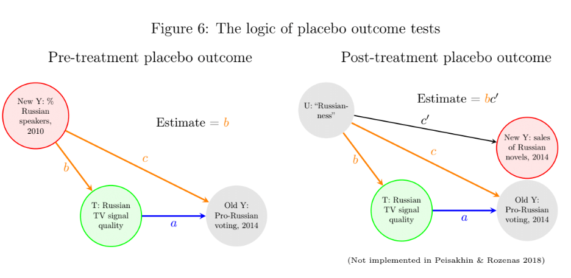
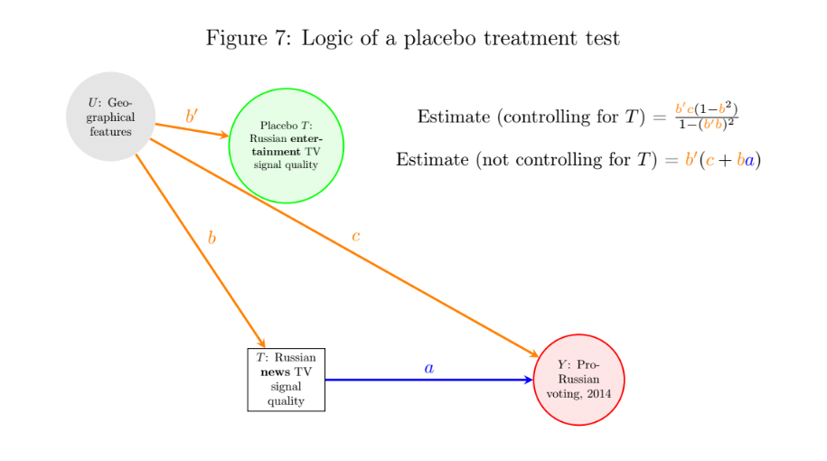
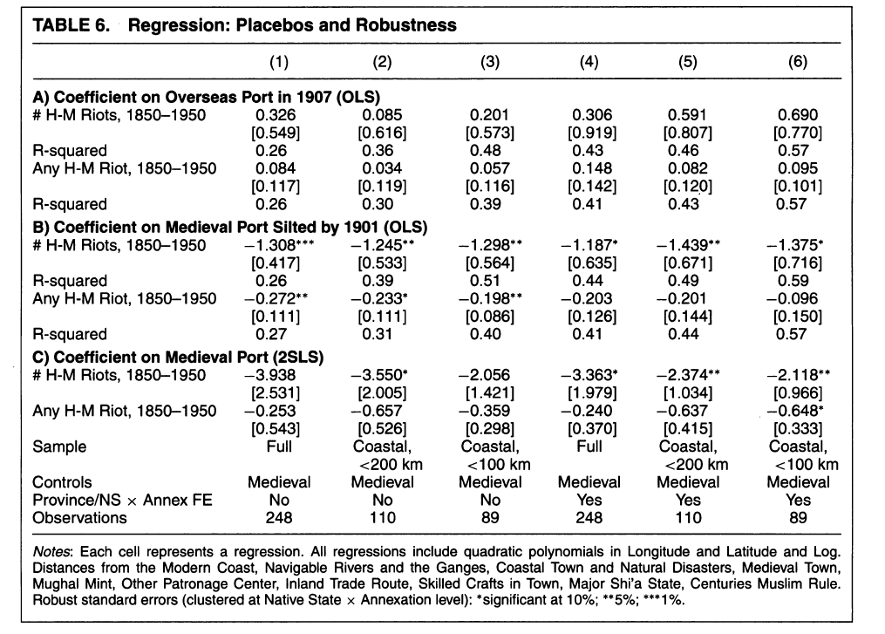
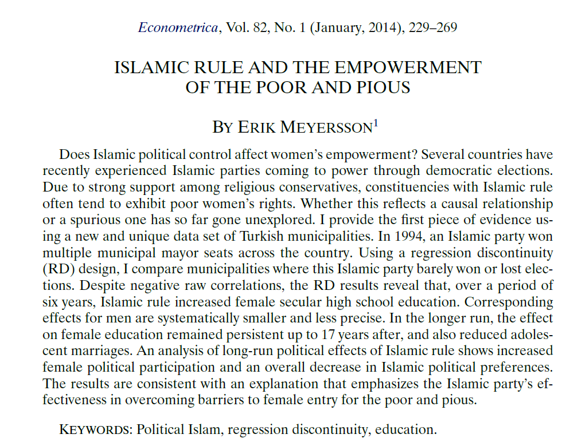
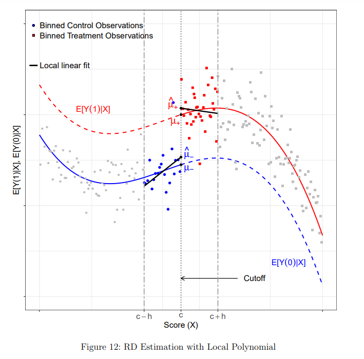
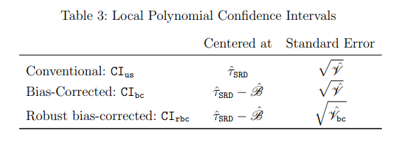

```{r setup, include=FALSE}
knitr::opts_chunk$set(echo = TRUE, eval=TRUE, warning=FALSE, message=FALSE)
```


# Today's plan
- Placebos
- RDD with `rdrobust` 

# Housekeeping
- Midterm this Wednesday
- Class time: 10-11.50 in 217
- Papers will be provided

# Placebos
This section uses the exposition in [Eggers, Tuñón and Dafoe (2021)](https://www.dropbox.com/s/pe1rlyqm36zddiq/20-11-15_placebo_tests_v2.pdf?dl=0)

- In medical studies a placebo is a "fake treatment" delivered to patients in the control group
- In observational studies, a placebo analysis means testing a relationship that our causal theory suggests to be 0
- Idea: if our theory/assumptions dictate an effect must not be there, finding it means the theory/assumptions are incorrect


# Typologies of placebo
From Eggers, Tuñón and Dafoe (2021): placebo analyses change elements of the research design while maintaining the same design

- Placebo population: same design on a different (sub-)population
- Placebo outcome: change the outcome variable 
- Placebo treatment: change the treatment variable

# Placebos: general concepts
- In a placebo test, only the feature of the design that is a "placebo" has to change
- All the other features of the design must be the same
- Otherwise not a real placebo: we just pick up different things so we can't compare the two results


# Placebo population: bias


# Placebo population: mechanisms/exclusion restriction violations



# Placebo population: other examples


# Placebo outcomes


# Placebo outcomes
Allow for different types of tests:

- Assessing *balance* across treated and controls: e.g. Cinelli and Hazlett (2020)
- Also assess different mechanisms


# Placebo treatments
- We just use a treatment that we know has 0 effect
- Main question is: do we include the actual treatment in the test or not?
  - Tradeoff: if we don't include it, we may fail the placebo test because we pick up the "actual" treatment effects. If we do, we lose power (because we take away variation in the placebo variable)
  
# Placebo treatments



# Placebo treatments: other examples


# Placebos: summary
- Placebos give credibility to identification assumptions and allow to detect problems
- We should always think about them at the **design stage** (to collect appropriate data) 
- Remember that a placebo is valid if the design remains the same except for the thing that you change

# RDD
In this section: hands-on approach to RDD based on [Cattaneo, Idrobo, and Titiunik (2019)](https://cattaneo.princeton.edu/books/Cattaneo-Idrobo-Titiunik_2019_CUP-Vol1.pdf)

We will use the state of the art: the packages `rdrobust`, `rdlocrand`, `rddensity` (available in both Stata and R format).

Next week: Topics in RDD (estimation issues, fuzzy RDD, local randomization approach)

# Working example: Meyersson (2014)
{width=75%}


# Meyersson (2014)
**Causal effect of interest**: Victory of Islamic candidate on educational attainment of women

Elements:

- **Outcome (Y)**: percentage of women aged 15-20 in 2000 who had completed high school by 2000
- **Running variable (X)**: vote percentage of the Islamic party minus vote percentage of the strongest secular opponent
- **Treatment (T)**: 1 if Islamic party won in 1994, 0 otherwise

# Let's begin
```{r}
library(rdrobust); library(rddensity); library(haven)

# Import data and define variables
data <- read_dta("CIT_2019_Cambridge_polecon.dta")

Y <- data$Y
X <- data$X
T <- data$T
T_X <- T*X

```


# Visualization
\pause
\tiny
```{r, fig.align='center', out.width = "75%"}
# Before we begin:
# ?rdplot

# Raw means comparison
rdplot(Y, X, nbins = c(2500, 500), p = 0, col.lines = "red", col.dots = "black", title = "", 
       x.label = "Islamic Margin of Victory", y.label = "Female High School Percentage", y.lim = c(0,70))
```


# Visualization
\tiny
```{r, fig.align='center', out.width = "75%"}
# Local means comparison
rdplot(Y[abs(X) <= 50], X[abs(X) <= 50], nbins = c(2500, 500), p = 4, col.lines = "red", col.dots = "black", 
       title = "", x.label = "Islamic Margin of Victory", y.label = "Female High School Percentage", 
       y.lim = c(0,70))
```

# Binning
It may be hard to spot visually discontinuities in raw data. A common approach is to "smooth" the data by binning. We have two things to do:

- Split the raw data into segments (bins) of the running variable, compute the mean outcome in each bin, plot the mean outcome against the mid point of the bin
- Overlay global polynomial fit of the outcome on the running variable, estimated **separately** on each side of the cutoff and using the **raw data**

We can do this automatically with the `rdplot` command

# Binning
Set bin size manually: evenly-spaced.
\tiny
```{r, fig.align='center', out.width = "75%"}
# Default is 4th polynomial degree on each side
rdplot(Y, X, nbins = c(20,20), binselect = "es", y.lim = c(0,25))
```

# Principled binning
Some procedures retain information about the actual distribution of the data and reduce discretion. For instance, quantile-spaced bins.
\tiny
```{r, fig.align='center', out.width = "75%"}
rdplot(Y, X, nbins = c(20,20), binselect = 'qs', x.label = 'Score', 
       y.label = 'Outcome', title = '', x.lim = c(-100,100), y.lim = c(0,25))
```

# Principled binning
We can also have a data-driven approach to the number of bins: default is minimize the IMSE of the local means estimator (optimizing along bias-variance)
\tiny
```{r, fig.align='center', out.width = "75%"}
rdplot(Y, X, binselect = 'qs', x.label = 'Score', 
       y.label = 'Outcome', title = '', x.lim = c(-100,100), y.lim = c(0,25))
```

# Principled binning
Mimicking variance: choose number of bins so that the variability of means "mimicks" that of the raw data.
\tiny
```{r, fig.align='center', out.width = "75%"}
rdplot(Y, X, binselect = 'qsmv', x.label = 'Score', 
       y.label = 'Outcome', title = '', x.lim = c(-100,100), y.lim = c(0,25))
```


# Binning in sum
"Which method of implementation is most appropriate depends on the researcher's particular goal, for example, illustrating/testing for the overall functional form versus showing the variability of the data. We recommend to start with MV bins to better illustrate the variability of the outcome as a function of the score, ideally comparing ES and QS bins to highlight the distributional features of the score. Then, if needed, the researcher can select the number of bins to be IMSE-optimal in order to explore the global features of the regression function." (Cattaneo, Idrobo, and Titiunik 2019)

# Estimation of causal effects
**Continuity-based framework**

If the CEF functions are continuous at the cutoff, RDD identifies a causal effect at the cutoff.

But in practice there are never observations with exactly the cutoff value. So we need to approximate the CEF on both sides of the cutoff.

Global approximations are good for plots (descriptions), but are not suitable for estimation of the treatment effect: see [Gelman and Imbens (2019)](https://www.tandfonline.com/doi/pdf/10.1080/07350015.2017.1366909)

The best practice now is to use local polynomial functions with low order near the cutoff.

# Estimation of causal effects
In a sharp RD:

- Choose polynomial of order $p$ and a kernel function $K(.)$
- Choose a bandwidth $h$ around the cutoff $c$
- Estimate on each side of the cutoff a WLS regression with weights $K(\frac{X_i-c}{h})$:

$$
\begin{aligned}
{\color{red} \hat{Y}_i = \hat{\mu}_+ + \hat{\mu}_{+,1}(X_i -c) + \hat{\mu}_{+,2}(X_i -c)^2 + ... + \hat{\mu}_{+,p}(X_i -c)^p} \\
{\color{blue} \hat{Y}_i = \hat{\mu}_- + \hat{\mu}_{-,1}(X_i -c) + \hat{\mu}_{-,2}(X_i -c)^2 + ... + \hat{\mu}_{-,p}(X_i -c)^p} 
\end{aligned}
$$

- Calculate the sharp RD estimate: $\hat{\tau}_{SRD} = {\color{red} \hat{\mu}_+} - {\color{blue} \hat{\mu}_-}$, the difference of the two functions when $X_i = c$

# Estimation of causal effects



# Parameters
The relevant parameters are: bandwidth, kernel function, polynomial order

- **Kernel**: triangular one is recommended (weight = 0 outside $h$ and $\uparrow$ as we get closer to $c$) and default in `rdrobust`. Uniform and Epanechnikov are also available 
- **Bandwidth**: the most important thing. Usually chosen by a data-driven approach to minimize the MSE of the local polynomial point estimator
- **Polynomial order**: low to avoid overfitting, generally local linear is the default choice

# Estimation
\tiny
```{r}
# By default c = 0
out <- rdrobust(Y, X, kernel = "uniform", p = 1, h = 20)
summary(out)
```


# Estimation
`rdrobust` has a function `rdbwselect` which can select a variety of optimal bandwidths. It is a stand-alone function, but can be called from inside `rdrobust` using the option `bwselect`


# Estimation
\tiny
```{r}
# Choose h to minimize MSE
out <- rdrobust(Y, X, kernel = "triangular", p = 1, bwselect = "mserd")
summary(out)
```


# Illustrate the main effect
\tiny
```{r, fig.align='center', out.width = "75%"}
bw <- out$bws[1,1]
rdplot(Y[abs(X)<=bw], X[abs(X)<=bw], p = 1, kernel = 'triangular', 
       x.label = 'Score', y.label = 'Outcome', title = '', y.lim = c(10,22))
```


# Inference
The local polynomial function is just an approximation, as such may be biased. In order to make inference, we need to take into account the bias.

Routine approaches differ in whether

- They remove the estimated bias from the derivation of the confidence intervals
- They take incorporate extra variability from bias removal in the standard error estimate

# Inference



# Inference
Robust bias correction enables to do valid inference using the same bandwidth used for the point estimate. 

Another approach is to use a different bandwidth for the calculation of the standard error.

# Inference
\tiny
```{r}
out <- rdrobust(Y, X, kernel = 'triangular',  p = 1, bwselect = 'mserd', all = TRUE)
summary(out)
```

# Conclusion
- Look at the documentation of the package
- See CIT for additional examples and code snippets in Stata as well