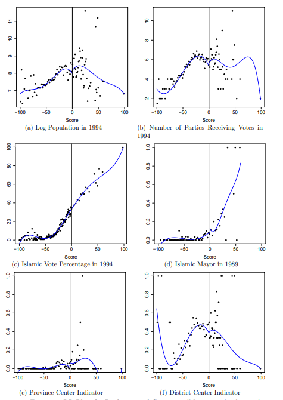
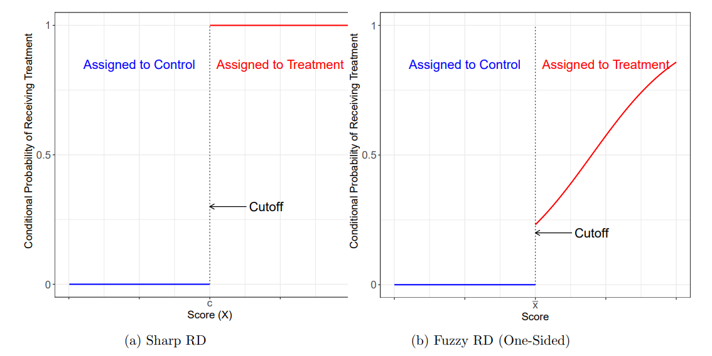
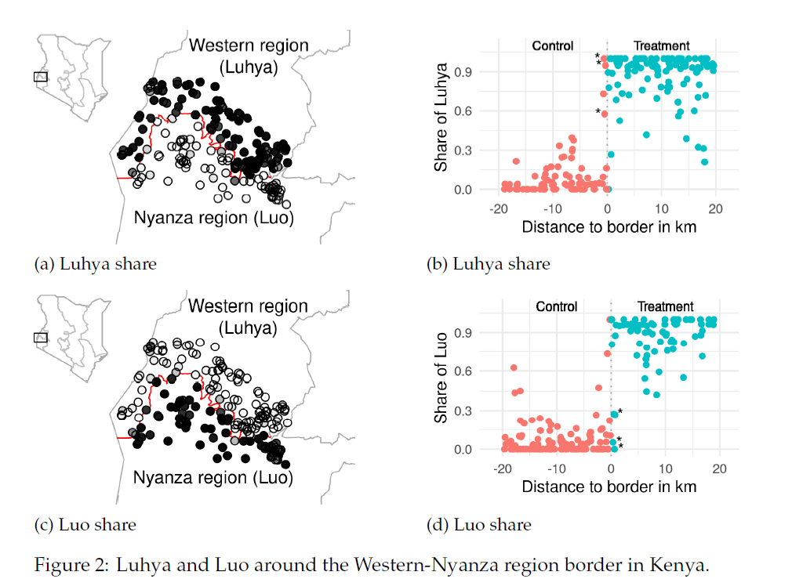
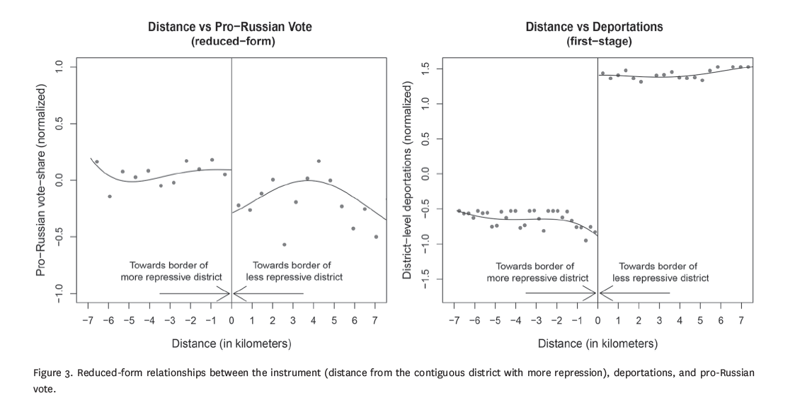
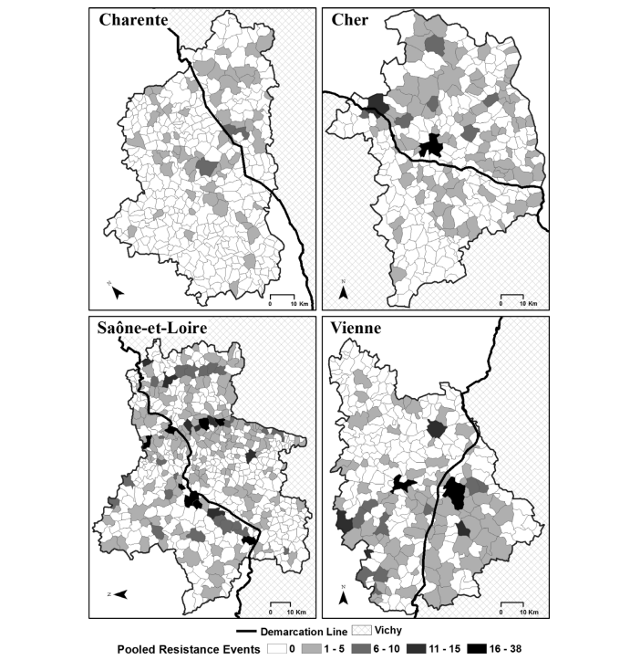
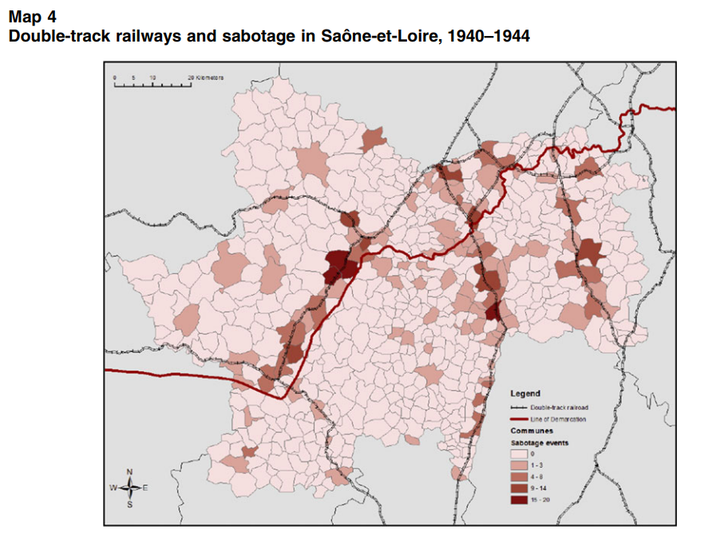
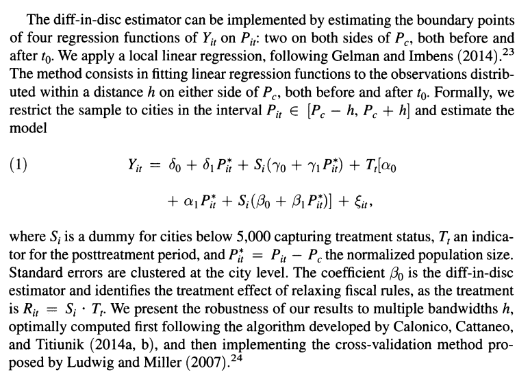
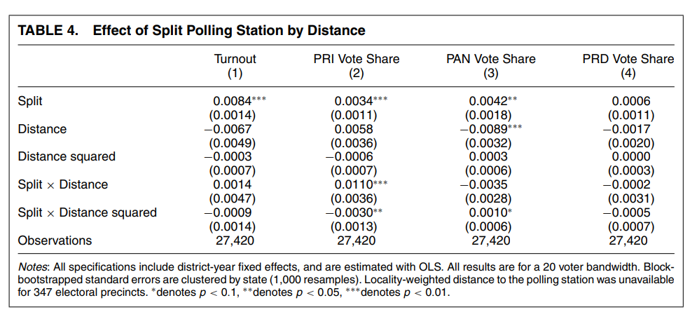
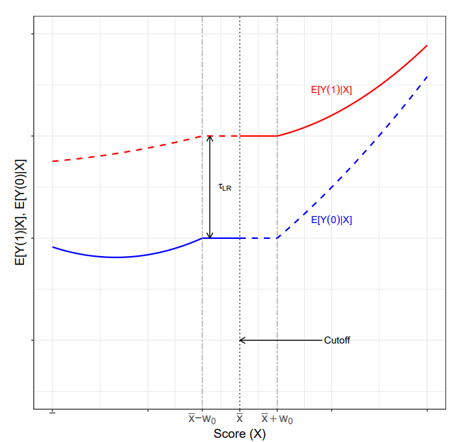
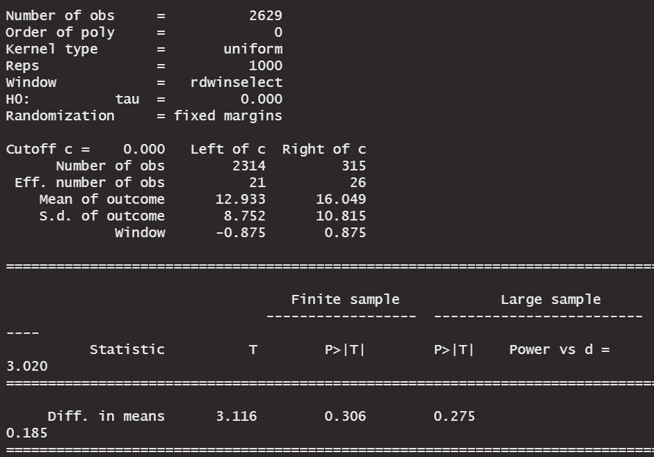

```{r setup, include=FALSE}
knitr::opts_chunk$set(echo = TRUE, eval=TRUE, warning=FALSE, message=FALSE)
```

# Today's plan
Additional tools and popular RDD typologies

- Validation tests
- Covariates
- Fuzzy RDD
- Geographic RDD
- DiD + RDD = Diff-in-Disc
- Local randomization approach

# Sources and material
We are still using Cattaneo, Idrobo, and Titiunik (2019) as our main source.

- [Text](https://cattaneo.princeton.edu/books/Cattaneo-Idrobo-Titiunik_2019_CUP-Vol1.pdf)
- [Full code](https://github.com/rdpackages-replication/CIT_2019_CUP)

In the second part: Cattaneo, Idrobo, and Titiunik (forthcoming).

- [Text](https://cattaneo.princeton.edu/books/Cattaneo-Idrobo-Titiunik_2018_CUP-Vol2.pdf)


# When are RDD assumptions violated?
Key identification assumption behind RDD: potential outcomes are continuous at the cutoff. 
$$\lim_{x \to c^+} E[Y_i(j)|X=x] = \lim_{x \to c^-} E[Y_i(j)|X=x] = E[Y_i(j)|X=c], j \in (0,1)$$
In other words, units just to the left of the cutoff are virtually identical to those just to the right.

There are instances where this assumption can be plausibly violated.

# When are RDD assumptions violated?
Quite simply: units know the cutoff determines the treatment assignment and try to get just above it. 

In the Meyersson example: Islamic parties may invest more in winning the election in some important municipalities. If they were successful, units with a bare victory would be different from cities with a bare defeat, i.e. a discontinuity at the cutoff.

We cannot directly test the continuity assumptions because of the fundamental problem etc etc. But we can check for discontinuities in observable variables that we would expect to be continuous. \pause

**Placebos!**

# RDD with placebo outcomes
We run the same RDD design, but with outcomes that we know should not change discontinuously at the cutoff.

Pre-determined covariates or outcomes that the theory/design should predict to be unrelated to the treatment, but would be related if there was confounding.


# RDD with placebo outcomes
```{r, echo=FALSE}
library(haven); library(rdrobust)

# Import data and define variables
data <- read_dta("CIT_2019_Cambridge_polecon.dta")

Y <- data$Y
X <- data$X
T <- data$T
T_X <- T*X
```


{height=75%}

# RDD with placebo outcomes
\tiny
```{r, out.width="80%"}
bw <- rdrobust(data$partycount, X)$bws[1, 1]
xlim <- ceiling(bw)
rdplot(data$partycount[abs(X) <= bw], X[abs(X) <= bw],
       p = 1, kernel = "triangular", x.lim = c(-xlim, xlim), x.label = "Islamic vote margin", y.label = "", title = "")
```


# Density of the running variable
Intuition: if units knew the position of the cutoff and could **exactly** manipulate their value of the running variable, we could observe sorting around the cutoff. It is natural to expect this would be associated to violations of continuity.

What are settings where units can manipulate their score?

# Density tests
A formal test: estimate the density of the running variable with a local polynomial density estimator on the two sides of the cutoff. Then test the null that the density is the same on the two sides.

The classical test is the one proposed by [McCrary (2008)](https://www.sciencedirect.com/science/article/pii/S0304407607001133). 

- Stata: user-written program `DCdensity` (to be [downloaded](https://eml.berkeley.edu/~jmccrary/DCdensity/))
- R: `DCdensity` in the package `rdd` 

Another test is proposed by [Cattaneo, Jansson and Ma (2020)](https://www.tandfonline.com/doi/full/10.1080/01621459.2019.1635480)

- `rddensity` in R and Stata 

# Density tests
\tiny
```{r}
library(rddensity)

out <- rddensity(X)
summary(out)

```
# Density tests
\tiny
```{r}
library(lpdensity)

bw_left <- as.numeric(rddensity(X)$h[1])
bw_right <- as.numeric(rddensity(X)$h[2])

est1 <- lpdensity(data = X[X < 0 & X >= -bw_left], grid = seq(-bw_left, 0,
                                                              0.1), 
                  bwselect = "IMSE", scale = sum(X < 0 & X >= -bw_left) / length(X))

est2 <- lpdensity(data = X[X >= 0 & X <= bw_right], grid = seq(0, bw_right,
                                                               0.1), 
                  bwselect = "IMSE", scale = sum(X >= 0 & X <= bw_right) / length(X))

```

# Density tests
\tiny
```{r, out.width="80%"}
library(ggplot2)
plot1 <- lpdensity.plot(est1, est2, CIshade = 0.2, lcol = c(4, 2), CIcol = c(4, 2), legendGroups = c("Control", "Treatment")) + 
  labs(x = "Score", y = "Density") + geom_vline(xintercept = 0, color = "black") +
  theme_bw(base_size = 17)+theme(legend.position = c(0.8, 0.85))
plot1
```

# RDD with placebo cutoffs
Idea of placebo treatments: replace the treatment with one that has no effect by construction but could suffer from the same confounding. If you find an effect, there is probably confounding also in the original treatment effect. 

In RDD we can vary artificially the cutoff to see if there are discontinuities in the CEF at points where there is no real treatment. 

Since we just need continuity *at the cutoff*, discontinuities away from it are not proof of bias (Cattaneo, Idrobo, and Titiunik 2019). But they do raise a flag.

# RDD with placebo cutoffs
\tiny
```{r}
placebo <- function(Y, X, new_cutoff){
  if (new_cutoff > 0){
    Y <- Y[X>=0]; X <- X[X>=0]
  }
  if (new_cutoff < 0){
    Y <- Y[X<0]; X <- X[X<0]
  }
  else{
    Y <- Y; X <- X
  }

  out <- rdrobust(Y, X, c = new_cutoff)
  coef <- out$coef["Conventional",]
  ll <- out$ci["Robust",1]
  ul <- out$ci["Robust",2]
  
  cbind(coef, ll, ul)
}

cutoffs <- as.list(c(-3:3))
(placebos <- do.call("rbind", lapply(cutoffs, function(i) placebo(Y, X, i))))
```

# RDD with placebo cutoffs
\tiny
```{r, fig.align="center", out.width="75%"}
library(dplyr)
placebos %>% as.data.frame() %>% mutate(cutoff = -3:3) %>% 
  ggplot(aes(x=cutoff, y=coef)) + geom_point(col="red") +
  geom_errorbar(aes(ymin=ll, ymax=ul), col="blue",width=0.1) + 
  labs(y = "RD Treatment Effect", x = "Cutoff (x=0 true cutoff)") +
  geom_hline(yintercept=0, col="black", linetype = "dashed") + theme_bw()
```

# Sensitivity checks
Cattaneo, Idrobo and Titiunik recommend to perform sensitivity analyses:

- Exclude points closer to the cutoff and check stability of the results
- Vary the bandwidth and check stability of the results
  - This should be done in a neighborhood of the optimal bandwidth, e.g. by varying the bandwidth selection criterion, without selecting manually too large or small values

# Summing up
As for other research designs, RDD assumptions need to be defended. Common practice is to include

- Graphical and formal placebo tests with covariates and other outcomes
- Density tests for sorting around the cutoff
- Perturbate the cutoff values
- Exclude observations near the cutoff
- Vary the bandwidth choice

# Covariates
Can we add covariates to RDD estimation?

[Calonico, Cattaneo, Farrell, and Titiunik (2019)](https://cattaneo.princeton.edu/papers/Calonico-Cattaneo-Farrell-Titiunik_2019_RESTAT.pdf): study properties of RDD estimators with covariate adjustment.

- There can be an efficiency argument in favor of adjusting for covariates ($\sim$ randomized experiments)
- You can also invoke covariate adjustment for achieving identification, although this requires stronger parametric assumptions
  - In empirical work, often people include group fixed effects or unbalanced covariates
- CCFT recommend not to interact covariates with treatment indicator (allowing for different effects on the two sides requires stronger assumptions)
- In `rdrobust`: use the  `covs` argument

# Fuzzy RDD
Idea: endogenous treatment take-up or non-compliance.



# Fuzzy RDD
This is just an IV model where the treatment $D$ is endogenous and the cutoff rule gives the instrument:

$$\frac{\lim_{x \to c^+} E[Y_i|X=x] - \lim_{x \to c^-} E[Y_i|X=x]}{\lim_{x \to c^+} E[D_i|X=x] - \lim_{x \to c^-} E[D_i|X=x]} = \tau_{FRD}$$
under the usual IV assumptions.

If the treatment effects are heterogeneous, $\tau_{FRD}$ can also have a LATE interpretation.

Once people could have used IV regression. In `rdrobust`: argument `fuzzy`.

# Geographic RDD
There are cases where treatment assignment depends on more than one running variable: e.g. admissions based on multiple test scores or policy eligibility based on more than one criteria.

We focus here on Geographic RDD, which is a popular and widely used one.

In essence, treatment is defined as being on a given side of a geographic boundary (intuition with a long history in CP).

Why do we have more than one running variable?


# Geographic RDD
Basic differences with respect to standard RDD:

- Continuity along both dimensions
- GRD identifies an effect at every boundary point: a *treatment effect curve*
- One could estimate the effect at different points of the boundary to characterize heterogeneity
  - See also [Frey (2019)](https://www.andersonfrey.com/uploads/5/9/0/0/59009301/paper_rr_dec2018.pdf)

# Geographic RDD
[Dell (2010)](https://scholar.harvard.edu/files/dell/files/ecta8121_0.pdf)

{width=70%}

# Geographic RDD
[Müller-Crepon (2021)](http://www.carlmueller-crepon.org/publication/admin_identities/CMC_BuildingTribes.pdf)

{height=85%}


# Geographic RDD
[Rozenas, Schutte, and Zhukov (2017)](https://www.journals.uchicago.edu/doi/abs/10.1086/692964)


# Geographic RDD: things to keep in mind
Discussion in [Keele and Titiunik (2015)](https://www.cambridge.org/core/services/aop-cambridge-core/content/view/2A59F3077F49AD2B908B531F6E458430/S1047198700011645a.pdf/div-class-title-geographic-boundaries-as-regression-discontinuities-div.pdf)

GRDD have distinct challenges:

- Possible compound treatments (e.g. multiple units sharing the same boundary)
- Sparsity of units around the boundary can be more serious (since we want continuity in two dimensions)
- Non-exogeneity of the boundary

# Non-exogeneity of the boundary
[Ferwerda and Miller (2014)](https://www.cambridge.org/core/services/aop-cambridge-core/content/view/D6683A3560C162165826E33CEA72B95D/S0003055414000240a.pdf/div-class-title-political-devolution-and-resistance-to-foreign-rule-a-natural-experiment-div.pdf)

{height=80%}

# Non-exogeneity of the boundary
{height=90%}

# Non-exogeneity of the boundary
[Kocher and Monteiro (2016)](https://www.cambridge.org/core/services/aop-cambridge-core/content/view/49EBB15B1B8F1E4A3B4441D46725CBED/S1537592716002863a.pdf/lines_of_demarcation_causation_designbased_inference_and_historical_research.pdf) \pause

{height=75%}

# Non-exogeneity of the boundary
{height=90%}


# Difference-in-discontinuities
Add a dimension of heterogeneity (usually time) in RDD.

- Resolve problems of compound treatment when one of the treatments is added after the other
- Estimate moderation effects

Usually "standard" regression models estimated within a bandwidth, more parametric assumptions.

# Difference-in-discontinuities
[Grembi, Nannicini, and Troiano (2016)](https://www.jstor.org/stable/pdf/24739127.pdf?casa_token=K_64pn0NlVkAAAAA:By9zpo_974A8ONzhHTvFW9oiEeDwuPY4rI7VIhyP2IXFZ0sufr1-82IOCggjN2mZAf54srViLNvqPH9onb8vwM0rMDDFADy_dAlK5CVHrHQOC7GHFqU)

{height=80%}

# Difference-in-discontinuities
[Larreguy, Marshall, and Querubín (2016)](https://www.cambridge.org/core/services/aop-cambridge-core/content/view/48C2C56999E4C50F47D3EBC920208E45/S0003055415000593a.pdf/parties-brokers-and-voter-mobilization-how-turnout-buying-depends-upon-the-party-s-capacity-to-monitor-brokers.pdf)



# Local randomization
An alternative approach to RDD: instead of assuming continuity, we assume random assignment in a neighborhood of the cutoff.

LRD assumptions (CIT Vol.2): 

Given a window $W_0$ around the cutoff:

- The distribution of the running variable in the $W_0$ is known, is the same for all units, and does not depend on the potential outcomes: $F_{X_i|X_i \in W_0}(x) = F(x)$
- Inside $W_0$, the potential outcomes depend on the running variable solely through the treatment indicator $T_i = \mathbb{I}(X_i > c)$, but not directly: $Y_i(X_i, T_i) = Y_i(T_i)$ for all $i$ such that $X_i \in W_0$

Relative to the continuity approach, it has more restrictive assumptions, but the advantage of finite sample inference methods.

# Local randomization
{height=85%}

# Local randomization
Estimation and inference under local randomization approach is implemented by the function `rdrandinf` in the package `rdlocrand`.

Data-driven approach to specify the window: specify pre-determined covariates and choose larger and larger windows until T and C units are no longer balanced on them. Inference uses Fisherian methods (randomization inference for the sharp null).

# Estimation
To choose the window, the researcher specifies:

- Covariates to be used for balance
- Test statistic to be used for assessing balance (e.g. difference in means)
- Randomization mechanism
- Minimum number of observations in the smallest window
- Significance level

Then: difference-in-means within the selected window with randomization inference.

# Application to Islamic mayors
\tiny
```{r}
library(rdlocrand)
Z <- cbind(data$i89, data$vshr_islam1994, data$partycount, data$lpop1994,
           data$merkezi, data$merkezp, data$subbuyuk, data$buyuk)
colnames(Z) = c("i89 ", "vshr_islam1994", "partycount", "lpop1994",
                "merkezi", "merkezp", "subbuyuk", "buyuk")
```


# Application to Islamic mayors
\tiny
```{r, eval=F}
out <- rdrandinf(Y, X, covariates = Z, seed = 50, d = 3.019522)
```

{height=80%}
