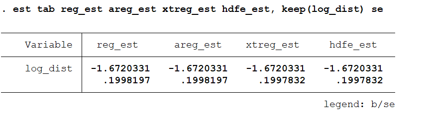
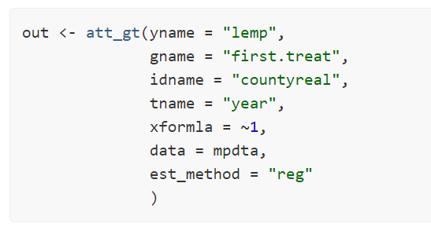
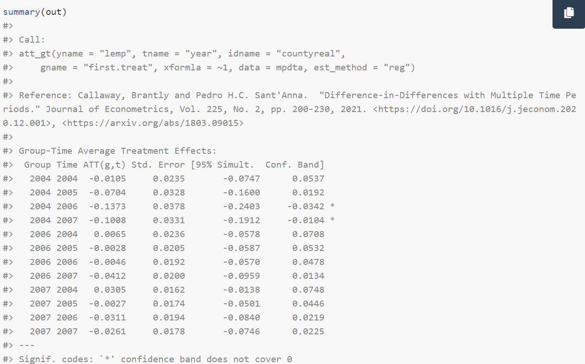

```{r setup, include=FALSE}
knitr::opts_chunk$set(echo = TRUE, eval=TRUE, warning=FALSE, message=FALSE)
```

# Today's plan
- Review: fixed effects estimation
- Packages
- Friendly TWFE review
- Yet more packages


# Review: fixed effects estimation
Fixed effects allow us to use "within" variation.

Idea: different units may have different propensities to select in the treatment according to their characteristics. Thus just comparing outcome levels in treated vs non-treated units may be misleading.

If we have different observations for each unit, we can use clean the estimates from the unit-level heterogeneity that we cannot identify in a cross-section.

# Review: fixed effects estimation
We are removing (or conditioning on) the average differences across units to focus only on variation coming from changes in treatment status *for the same unit*.


# De-meaning is equivalent to controlling for unit dummies
Suppose we have the following model.

$$y_{it} = \alpha_i + X'_{it}\beta + \epsilon_{it}$$

where $\alpha_i$ is a dimension of unit-level heterogeneity that does not change with time.

In our dataset, with many periods $t$ for each unit $i$ we can identify the $\alpha_i$ by adding a dummy variable for each $i$. 

$$y = \alpha + X'\beta + \epsilon$$
Call $N$ the number of units, $T$ the number of periods. What is the size of each matrix? \pause

What is our estimator of $\beta$ if we control for unit-specific dummies?


# De-meaning is equivalent to controlling for unit dummies
By FWL theorem:
$$\hat{\beta} = (X'M_{[\alpha]}X)^{-1} X'M_{[\alpha]}y$$

where $M$ is the residualizing matrix. Its generic form is $M_{[Z]} = I - Z(Z'Z)^{-1}Z'$

# De-meaning is equivalent to controlling for unit dummies
In this case we are residualizing by a matrix of unit-level dummies:

$$M_{[\alpha]} = I - \alpha(\alpha'\alpha)^{-1}\alpha'$$

where 

$$
\alpha = \begin{bmatrix}
\mathbf{1}_T & \mathbf{0}_T & .. & \mathbf{0}_T \\
\mathbf{0}_T & \mathbf{1}_T & .. & \mathbf{0}_T \\
.. & .. & .. & .. \\
\mathbf{0}_T & \mathbf{0}_T & .. & \mathbf{1}_T 
\end{bmatrix}
$$

# De-meaning is equivalent to controlling for unit dummies

$$
(\alpha'\alpha)^{-1} = \begin{bmatrix}
T & 0 & .. & 0 \\
0 & T & .. & 0 \\
.. & .. & .. & .. \\
0 & 0 & .. & T 
\end{bmatrix}^{-1} = \begin{bmatrix}
\frac{1}{T} & 0 & .. & 0 \\
0 & \frac{1}{T} & .. & 0 \\
.. & .. & .. & .. \\
0 & 0 & .. & \frac{1}{T} 
\end{bmatrix}
$$


Then

$$
\alpha(\alpha'\alpha)^{-1} = \frac{1}{T}\begin{bmatrix}
\mathbf{1}_{T} & \mathbf{0}_{T} & .. & \mathbf{0}_{T} \\
\mathbf{0}_{T} & \mathbf{1}_{T} & .. & \mathbf{0}_{T} \\
.. & .. & .. & .. \\
\mathbf{0}_{T} & \mathbf{0}_{T} & .. & \mathbf{1}_{T} 
\end{bmatrix}
$$


# De-meaning is equivalent to controlling for unit dummies
Finally

$$
\begin{aligned}
\alpha(\alpha'\alpha)^{-1}\alpha' = \frac{1}{T}
\begin{bmatrix}
\mathbf{1}_{T} & \mathbf{0}_{T} & .. & \mathbf{0}_{T} \\
\mathbf{0}_{T} & \mathbf{1}_{T} & .. & \mathbf{0}_{T} \\
.. & .. & .. & .. \\
\mathbf{0}_{T} & \mathbf{0}_{T} & .. & \mathbf{1}_{T} 
\end{bmatrix} \begin{bmatrix}
\mathbf{1}'_{T} & \mathbf{0}_{T} & .. & \mathbf{0}_{T} \\
\mathbf{0}_{T} & \mathbf{1}'_{T} & .. & \mathbf{0}_{T} \\
.. & .. & .. & .. \\
\mathbf{0}_{T} & \mathbf{0}_{T} & .. & \mathbf{1}'_{T} 
\end{bmatrix} = \\
\frac{1}{T} \begin{bmatrix}
\mathbf{1}_{T\times T} & \mathbf{0}_{T\times T} & .. & \mathbf{0}_{T\times T} \\
\mathbf{0}_{T\times T} & \mathbf{1}_{T\times T} & .. & \mathbf{0}_{T\times T} \\
.. & .. & .. & .. \\
\mathbf{0}_{T\times T} & \mathbf{0}_{T\times T} & .. & \mathbf{1}_{T\times T} \end{bmatrix}
\end{aligned}
$$


# De-meaning is equivalent to controlling for unit dummies
So that

$$
M_{[\alpha]}X = (I - \alpha(\alpha'\alpha)^{-1}\alpha') X = \begin{bmatrix}
X_{11} \\
X_{12} \\
X_{13} \\
X_{21} \\
X_{22} \\
X_{23} \\
..
\end{bmatrix} - 
\begin{bmatrix}
\sum_{t = 1}^T X_{1t} \\
\sum_{t = 1}^T X_{1t} \\
\sum_{t = 1}^T X_{1t} \\
\sum_{t = 1}^T X_{2t} \\
\sum_{t = 1}^T X_{2t} \\
\sum_{t = 1}^T X_{2t} \\
..
\end{bmatrix} \frac{1}{T}
$$

# Controlling for unit dummies is equivalent to "within" regressions
We have seen in class that the OLS estimates with unit FE converges to

$$
\beta = \frac{\sum_i \rho_i V[D_{it}|i] Pr[i]}{\sum_i V[D_{it}|i] Pr[i]}
$$

Which is also equivalent to running $N$ separate regressions and aggregating the unit-specific estimates weighting by their treatment variance.


# Implications for research design
Bottom line: using the within estimator saves from the computational effort of estimating $N$ different coefficients.

Note also that any control variable that is time-invariant (i.e. fixed across units) will be similarly cancelled out by the within transformation.

One could conclude that if our research design uses panel data, we may not care about collecting time-invariant covariates, because we will be using unit FEs.

Still, even if they can't be used for the identification of an average effect, time-invariant variables may be crucial for assessing robustness, characterize the sample, etc.


# Implications for research design
There are also cases where the fixed effects have substantive value.

In labor economics: worker fixed effects in wage equations give us the wage component due to individual skills.

In studies of culture: fixed effect of having ancestors from a given country gives the "inherited" level of civic attitudes given by that country.


# A note on clustering SEs
Be careful to the case where in panel data you cluster your SEs at the same level of the fixed effects 

For instance, you have a panel of US counties, you use county FE and SEs clustered at the county level.

In that case, standard estimators in both Stata and R impose a "double-penalty" on the SEs by including the fixed effects in the small-sample adjustment, resulting in over-conservative SEs.

Most recent packages do not have this issue.


# A note on clustering
Let's now compare SE computation across packages in Stata and R.

Let's look at the most popular packages.

- Stata: `reg`, `areg`, `xtreg`, `reghdfe` 
- R: `lm`, `estimatr`, `lfe`, `fixest`
  - Note that `estimatr` is great for the analysis of randomized experiments, but can be very slow in large datasets with many FEs

We use sample data on trade flows, and estimate the "effect" of distance on price. We add FEs for country of origin and cluster SEs at the country of origin level. \pause

**Illustrative purposes, don't try this at home**


# A note on clustering

 


# A note on clustering
\tiny
```{r}
library(haven); library(fixest); library(estimatr); library(lfe); library(sandwich); library(lmtest)
data(trade)

## lm (+ sandwich for clustered SEs)
lm_est <- lm(log(Euros) ~ log(dist_km) + as.factor(Origin), data=trade)

## estimatr::lm_robust
lmrob_est <- lm_robust(log(Euros)~log(dist_km), fixed_effects = ~Origin, clusters = Origin, se_type = "stata", data=trade)

## lfe::felm
lfe_est <- felm(log(Euros)~log(dist_km) | Origin | 0 | Origin, data = trade)

## fixest::feols
fixest_est <- feols(log(Euros)~log(dist_km) | Origin, cluster = ~Origin, data = trade)

mat <- matrix(NA, nrow = 4, ncol = 2)
rownames(mat) <- c("lm", "estimatr", "lfe", "fixest")
mat[1,1] <- coef(lm_est)["log(dist_km)"]
mat[1,2] <- coeftest(lm_est, vcov. = vcovCL(lm_est, cluster = ~ Origin))["log(dist_km)", "Std. Error"]
mat[2,1] <- coef(lmrob_est)["log(dist_km)"]
mat[2,2] <- lmrob_est$std.error["log(dist_km)"]
mat[3,1] <- coef(lfe_est)["log(dist_km)"]
mat[3,2] <- se(lfe_est)["log(dist_km)"]
mat[4,1] <- coef(fixest_est)["log(dist_km)"]
mat[4,2] <- se(fixest_est)["log(dist_km)"]
mat
```


# A note on clustering
In the case of "nested" clusters, R's `lfe` and `fixest` use very close procedure to Stata's `xtreg` and `reghdfe`.

In some datasets, I have found (very minor) differences in SEs between `xtreg` and `reghdfe`: in those cases `lfe` and `fixest` are usually identical or closer to `xtreg`.

In cases where there is no nesting, all packages should give the same SEs (at least with the default options).

Always double-check what your package is doing.


# TWFE
This discussion follows [de Chaisemartin and D’Haultfœuille (2021)](https://papers.ssrn.com/sol3/papers.cfm?abstract_id=3980758)
 
Standard DiD estimator with two groups and periods:

$$
DID = \bar{Y}_{s,2} - \bar{Y}_{s,1} - ( \bar{Y}_{n,2} -  \bar{Y}_{n,1})
$$


Two-way fixed effects model (TWFE):

$$
Y_{i,g,t} = \beta_{fe} D_{g,t} + \alpha_g + \gamma_t + \epsilon_{g,t}
$$

With two groups (treated/untreated) and two periods (pre/post treatment), the two estimators are identical.

Under the parallel trend assumption, they identify ATT for treated group $s$ at period 2.


# TWFE under heterogeneous treatment effects
[de Chaisemartin and D’Haultfœuille (2020)](https://drive.google.com/file/d/1D93ltJUirR4zIqJZfSTwSLrA-6rSZpTJ/view) establish the following result (assume binary treatment here):

$$
E[\hat{\beta}_{fe}] = \left[\sum_{(g,t): D_{g,t}\neq 0} W_{g,t} TE_{g,t}\right]
$$

where $TE_{g,t} = \bar{Y}_{g,t}(1) - \bar{Y}_{g,t}(0)$ and $W_{g,t} = \frac{N_{g,t}}{N_1} \frac{e_{g,t}}{\sum_{(g,t):D_{g,t}\neq 0}\frac{N_{g,t}}{N_1}e_{g,t}}$

and $e_{g,t} = D_{g,t} - D_{g,.} - (D_{.,t} - D_{.,.})$

This is different from the ATT, where the only weights are $\frac{N_{g,t}}{N_1}$

# Implications
$W_{g,t}$ sum to 1, and some may be negative. Think of negative TEs which receive a negative weight: they enter as positive in the sum. So the final estimated $\hat{\beta}_{fe}$ can be very different from the ATT, even have the opposite sign.

This does not arise if TEs are constant.

# Forbidden comparison
[Goodman-Bacon (2021)](http://goodman-bacon.com/pdfs/ddtiming.pdf) shows than with binary treatment and groups can only switch in treatment:

$$
\hat{\beta}_{fe} = \sum_{g\neq g', t<t'} v_{g,g',t,t'}DID_{g,g',t,t'}
$$
where the DIDs are all the possible DID comparisons between two groups at two time points and the $v$s are non-negative weights summing to one.

The 2X2 DIDs include comparisons between group pairs where one group has already been treated in the past. Intuitively, its treatment effect from the past treatment has to be subtracted out in the aggregation.

This "forbidden comparison" is the reason why some TEs end up weighted negatively.


# Alternative estimators
Several alternative estimators proposed. The common feature is the careful choice of control groups for treated groups.

A few examples:

de Chaisemartin and D’Haultfœuille (2020): $DID_M$ comparing groups that switch in treatment from $t-1$ to $t$ to groups that remain untreated in the same period. Similarly for groups that switch out to groups that remain treated.

[Callaway and Sant'Anna (2021)](https://psantanna.com/files/Callaway_SantAnna_2020.pdf): focus on staggered treatment adoption and define groups as treatment cohorts. Idea is to compare treated groups/cohorts to never-treated ones (if exist) or to not-yet-treated ones.

# Packages
Diagnostic packages:

- Estimate the weights $W_{g,t}$ in de Chaisemartin and D’Haultfœuille (2020)
  - `TwoWayFEWeights` (R), `twowayfeweights` (Stata)
- Bacon decomposition of TWFE and weights associated
  - `bacondecomp` (R/Stata)
- Decomposition of TWFE coefficients in event-study design (Sun and Abraham 2020)
  - `eventstudyweights` (Stata)

# Packages
Alternative, heterogeneity-robust estimators:

- de Chaisemartin and D’Haultfœuille (2020)
  - `DIDmultiplegt` (R), `did_multiplegt` (Stata)
- Callaway and Sant'Anna (2021)
  - `did` (R), `csdid` (Stata)
- Sun and Abraham (2020)
  - `fixest::sunab`, `staggered_sa` (R), `eventstudyinteract` (Stata)
- Borusyak et al (2021)
  - `didimputation` (R), `did_imputation` (Stata)
- Wrapper for almost all of the above (for robustness checks)
  - `did2s` (R)


# did


# did
{width="75%"}

# Comparisons and differences
See the review paper in [de Chaisemartin and D’Haultfœuille (2021)](https://papers.ssrn.com/sol3/papers.cfm?abstract_id=3980758) for a comparison of the different estimators.

They differ on the exact identification assumptions, but whether these differences are consequential or nuances ultimately depends on the specific case.

Depending on the specific features of the data (e.g. the exact type of deviations from PT, or the evolution of POs), some estimators are more/less biased or more/less efficient than others.

This is still an open area, where simulations can help (an example [here](https://github.com/fhollenbach/did_compare/blob/main/ComparingDiD.md)).

# Implications for practice
This does not imply that TWFE is dead. In some applications heterogeneity may not be a huge issue, in others [it is](https://papers.ssrn.com/sol3/papers.cfm?abstract_id=3794018). 

It may be a good idea to first check diagnostics for our design, to assess possible problems.

It seems that the empirical literature right now is in a phase of transition: show TWFE results and robustness to alternative estimators. But new methods are entering the mainstream.

New estimators still rely on ID assumptions, so as usual their plausibility should be defended on substantive grounds.

When designing your study, ask questions like: Do units also switch from treated to un-treated? Are there never-treated groups? If so, **why** is this the case?
