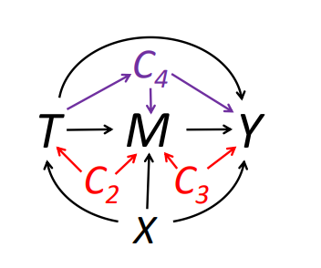
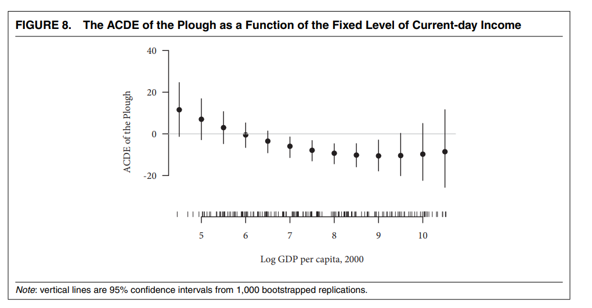
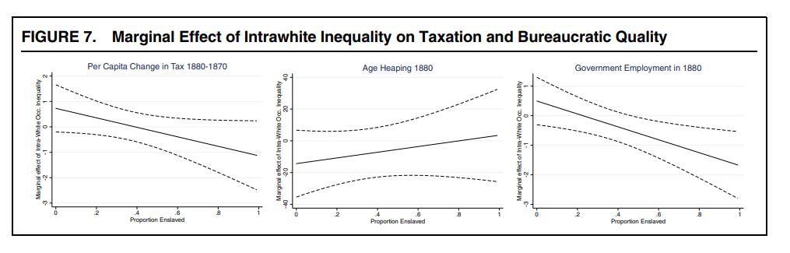

```{r setup, include=FALSE}
knitr::opts_chunk$set(echo = TRUE, eval=TRUE, warning=FALSE, message=FALSE)
```

# Today's plan
- Mediation (review and practice)
- Moderation and TE Heterogeneity (review and practice)

# Mediation
Concepts we have seen:

- Natural Direct Effect: $\zeta_i(t) = Y_i(1, M_i(t)) - Y_i(0, M_i(t))$
- "Natural Mediation Effect": $\delta_i(t) = Y_i(t, M_i(1)) - Y_i(t, M_i(0))$
- Total Effect: $\tau_i = Yi(1,Mi(1)) - Yi(0,Mi(0))$
- $\tau = \delta(t) + \zeta(1-t)$

$\delta$ and $\zeta$ can be identified under sequential ignorability.


# Sequential ignorability

$$
\begin{aligned}
T_i \perp (Yi(t',m), M_i(t))|X_i=x \\
M_i(t) \perp Y_i(t', m)|T_i, X_i=x
\end{aligned}
$$

The first part is CIA, satisfied by construction in a randomized experiment. 

The second part is "new": it means that there can't be omitted post-treatment confounders or other mediators causally connected to $M$. \pause

It is a strong assumption.

# Sequential ignorability
{align=center}

# Causal mediation analysis
The R package `mediation` performs causal mediation analysis under sequential ignorability. 

Idea: Identify the effect of $T$ on $M$ given $X$ and the effect of $M$ on $Y$ given $T$ and $X$. Then use them to compute the direct/mediation effects. In the special case of linear models you can multiply the coefficients.

# Causal mediation analysis
Working example from the `mediation` package: Brader et al (2008)

- $T$: Media stories about immigration
- $Y$: Letter about immigration policy to representative in Congress
- $M$: Anxiety
- $X$: Age, education, gender, income


# Casual mediation analysis
\tiny
```{r}
library(mediation)

data(framing)

set.seed(2014)

# Model for the mediator (T + X)
med.fit <- lm(emo ~ treat + age + educ + gender + income, data = framing)

# Model for the outcome (M + T + X)
out.fit <- glm(cong_mesg ~ emo + treat + age + educ + gender + income, data = framing, 
               family = binomial("probit"))

# Compute the mediation effects
med.out <- mediate(med.fit, out.fit, treat = "treat", mediator = "emo", 
                   robustSE = TRUE, sims = 100)
```


# Causal mediation analysis
\tiny
```{r}
summary(med.out)
```


# Controlled Direct Effect
Controlled Direct Effect: $\kappa_i(m) = Y_i(1,m) - Y_i(0,m)$

Effect of $T$ on $Y$ when $M$ has the same value for all units.

Relative to NDE and NME is identified also in presence of intermediate confounders.

The natural approach would be to include $M$ as control in the regression. If there are intermediate confounders, this introduces post-treatment bias. The CDE is an estimand that allows to overcome this issue.


# Sequential g-estimation
Popularized in polisci by [Acharya, Blackwell, and Sen (2016)](https://www.mattblackwell.org/files/papers/direct-effects.pdf)

Procedure in two stages:

- Regress $Y$ on $M$, $T$, pre-treatment and intermediate variables
- Subtract from $Y$ the effect of $M$: this is the "demediated" $Y$, $\tilde{Y} = Y - \hat{\beta_M}M$
- Regress $\tilde{Y}$ on $T$ and pre-treatment variables

This can be done by hand, but in this way one would ignore the variability in $\tilde{Y}$, due to the fact that it is estimated, resulting in wrong SEs.

Use the package `DirectEffect` or bootstrap.

Center the mediator at the value you want to "fix" it at.


# Sequential g-estimation
Why is it important?

Often questions we are interested in involve comparisons that "hold fixed" things realized after the treatment.

- Do natural shocks impact political development even in absence of town destruction?
- Does ethnic diversity lead to conflict even in absence of government instability?

We may also want to rule out specific causal mechanisms

- Are the effects of slavery/famine just due to subsequent changes in racial/ethnic composition? (Acharya, Blackwell, and Sen (2016); Rozenas and Zhukov (2019) resp.)


# An example
Data from [Alesina, Giuliano, and Nunn (2013)](https://scholar.harvard.edu/files/nunn/files/alesina_giuliano_nunn_qje_2013.pdf): provided with the `DirectEffects` package.

- $Y$: share of political positions held by women in 2000
- $A_i$: relative proportion of ethnic groups that traditionally used the plow within a country
- $M_i$: log GDP per capita in 2000, mean-centered
- $Z_i$: post-treatment, pre-mediator intermediate confounders
  - civil conflict, interstate conflict, oil, European descent, communist, polity2..)
- $X_i$: pre-treatment characterisrics of the country
  - tropical climate, agricultural suitability, large animals, political hierarchies, economic complexity, rugged


# An example
\tiny
```{r}
library(DirectEffects)

data("ploughs")

## ATE
ate_mod <- lm(women_politics ~ plow + agricultural_suitability + tropical_climate +
                large_animals + political_hierarchies + economic_complexity + rugged, 
              data = ploughs)

summary(ate_mod)[[4]]["plow",]

```

# An example
\tiny
```{r}
## Formula for sequential_g
form_main <- women_politics ~ plow + agricultural_suitability + tropical_climate +
  large_animals + political_hierarchies + economic_complexity + rugged | # pre-treatment vars
  years_civil_conflict + years_interstate_conflict  + oil_pc + european_descent +
  communist_dummy + polity2_2000 + serv_va_gdp2000 | # intermediate vars
  centered_ln_inc + centered_ln_incsq # mediating vars

## Sequential g-estimation
direct <- sequential_g(formula = form_main, data = ploughs)

```


# An example
\tiny
```{r}
summary(direct)
```

# More on DirectEffects

- You can conduct sensitivity analysis using `cdesens` function
- Can center mediator at different values to see how CDE varies at different values of $M$



# Moderation
Essentially characterizing treatment effect heterogeneity. \pause

Why do we care?

- Knowledge: going beyond the aggregation
- Policy: on what sub-populations the intervention is more effective
- Mechanisms: understanding what units drive the average effect gives insights about what the treatment is doing

\pause

Broadly speaking: regression-based methods vs non-parametric methods

# Moderation in regression
Classical approach is to use interaction terms. Let's start from the case of binary treatment $D_i$ and binary moderator $Z_i$. \pause

$$
y_i = \alpha + {\color{red}\beta} D_i + \gamma Z_i + {\color{blue}\delta} D_i*Z_i + \epsilon_i
$$
Assume all terms are identified. What do the coefficients measure? \pause

In this linear model:

- $E[y_i|D_i = 0, Z_i = 0] = \alpha$
- $E[y_i|D_i = 1, Z_i = 0] = \alpha + {\color{red}\beta}$
- $E[y_i|D_i = 0, Z_i = 1] = \alpha + \gamma$
- $E[y_i|D_i = 1, Z_i = 1] = \alpha + {\color{red}\beta} + \gamma + {\color{blue}\delta}$


# Moderation in regression
$$
y_i = \alpha + {\color{red}\beta} D_i + \gamma Z_i + {\color{blue}\delta} D_i*Z_i + \epsilon_i
$$
We have:

- $E[y_i|D_i = 0, Z_i = 0] = \alpha$
- $E[y_i|D_i = 1, Z_i = 0] = \alpha + {\color{red}\beta}$
- $E[y_i|D_i = 0, Z_i = 1] = \alpha + \gamma$
- $E[y_i|D_i = 1, Z_i = 1] = \alpha + {\color{red}\beta} + \gamma + {\color{blue}\delta}$

Thus:

- ${\color{red}\beta} = E[y_i|D_i = 1, Z_i = 0] - E[y_i|D_i = 0, Z_i = 0]$: effect of $D_i$ when $Z_i = 0$
- $\gamma = E[y_i|D_i = 0, Z_i=1] - E[y_1|D_i = 0, Z_i = 0]$: effect of $Z_i$ when $D_i=0$
- ${\color{blue}\delta} = [E[y_i|D_i = 1, Z_i = 1] - E[y_i|D_i = 0, Z_i = 1]] - [E[y_i|D_i = 1, Z_i = 0] - E[y_i|D_i = 0, Z_i = 0]]$: increase in the effect of $D_i$ when $Z_i$ goes from 0 to 1: a DiD!


# Moderation in regression
With continuous $D_i$ and/or $Z_i$: restate in terms of marginal effects (increase the variable by 1 unit).

Which of the above are of interest? Depends on what we want!

In the standard DiD, what we care about is the interaction term alone, i.e. the ATT estimate under parallel trends.

In this setting, we care about how ATE/ATT varies between strata of $Z$. We need to be careful about how to interpret each coefficient.

# Interpreting moderation in regression
Now let's generalize to continuous $Z$.

$$
y_i = \alpha + {\color{red}\beta} D_i + \gamma Z_i + {\color{blue}\delta} D_i*Z_i + \epsilon_i
$$
Recall:

- ${\color{red}\beta}$: effect of $D_i$ when $Z_i = 0$
- ${\color{blue}\delta}$: increase in the effect of $D_i$ when $Z_i$ increases by 1
- ${\color{red}\beta} + {\color{blue}\delta}*z$: average effect of $D_i$ when $Z_i = z$

${\color{red}\beta}$ is an ATE for a specific sub-group without necessarily a substantive value: may not even exist in the data.

If instead we center $Z_i$, e.g. interact by $Z^* = (Z_i - \bar{Z_i})$ then ${\color{red}\beta}$ is the ATE at the mean of the moderator (interpretable as population ATE).

# Moderation effect vs sub-group effects
${\color{blue}\delta}$ tells us by how much the ATE *varies* in a sub-group relative to a reference sub-group. 

It is *not* the ATE for a subgroup. E.g. ATE($z$) is given by ${\color{red}\beta} + {\color{blue}\delta}*z$.

We can compute the effect of $D$ for sub-groups with different values of $Z$ using standard packages: 

- `margins` in Stata
- `margins` and `marginaleffects` in R

# Issues with linear interaction terms
Researchers use linear interaction terms to study how the treatment effect evolves over the distribution of the moderator.

[Hainmueller, Mummolo, and Xu (2019)](https://scholar.princeton.edu/sites/default/files/jmummolo/files/how_much_should_we_trust_estimates_from_multiplicative_interaction_models_simple_tools_to_improve_empirical_practice.pdf) point out that this practice relies on requirements that can be violated:

- The TE changes linearly in the moderator at any point of its distribution
  - It may be non-linear or non-monotonic
- There is common support between treatment and moderator
  - If not, we rely on extrapolation from the linear model (recall our discussion about conditioning)

If these fail, our estimates can be model dependent.

# Working example


# interflex
Hainmueller, Mummolo, and Xu (2019) propose a more flexible procedure implemented by the `interflex` package (in both R and Stata)

**Binning estimator**

Divide the support of $Z$ into $j$ bins (e.g. terciles), indicated by $G_j$, and estimate
$$
y_{ij} = \sum_{j=1}^3\{\alpha_j + \beta_jD_{ij} + \gamma_j (Z_{ij} - Z^M_j) + \delta_j(Z_{ij} - Z^M_j)D_{ij}\}G_j + \psi X_{ij} + \epsilon_{ij}
$$

where $Z^M_j$ is the median value of $Z$ inside bin $j$.Given the specification $\beta_j$s are the conditional ATEs at the center of each bin.

# Moderation using the binning estimator



# Moderation using the binning estimator
\tiny
```{r, out.height="50%", fig.align="center"}
library(interflex); library(haven); library(tidyverse)

# Import the data
d <- read_dta("suri_white_preprocessed.dta") %>% as.data.frame()

# Raw data plot
# Note we are not including controls used in the paper, so no causal interpretation
interflex(estimator = "raw", data = d, Y = "tax_diff", D = "county_sei_gini_whitemale_1850", 
                 X = "pslave1860", ylab = "Marginal effect of GINI",
                 xlab = "Z: Proportion slaves in 1860", theme.bw = T, ncols=3,
          Dlabel = "White GINI 1850", Ylabel = "Per capita tax change 1880-1870",
          Xlabel = "Prop. slaves 1860")


```


# Moderation using the binning estimator
\tiny
```{r, out.height="60%", fig.align="center"}
# Heterogeneous TE with interflex (note in this notation Z and X are inverted)
out <- interflex(estimator = "binning", data = d, 
                 Y = "tax_diff", D = "county_sei_gini_whitemale_1850", 
                 X = "pslave1860", ylab = "Marginal effect of GINI",
                 xlab = "Z: Proportion slaves in 1860", theme.bw = T)

out$figure
```


# interflex
**Kernel estimator**

Allow the treatment effect to vary over the whole distribution of the moderator, estimating the following semiparametric model (again, notation in their paper inverts $X$ and $Z$)

$$
y_{i} = f(Z_i) + g(Z_i)D_i + h(Z_i)X_i + \epsilon_i
$$

# Moderation with the kernel estimator
\tiny
```{r, out.height="50%", fig.align="center"}
set.seed(123)
outk <- interflex(estimator = "kernel", data = d, 
                 Y = "tax_diff", D = "county_sei_gini_whitemale_1850", 
                 X = "pslave1860", ylab = "Marginal effect of GINI",
                 xlab = "Z: Proportion slaves in 1860", theme.bw = T)

outk$figure
```


# Diagnostic tools
`interflex` also gives diagnostic tools for model specification.

For example, Wald tests for the hypothesis that the simple linear interaction is correct.

With a slight reparametrization, the null hypothesis is that the coefficients within each bin but one are jointly 0, i.e. constant coefficients.
\tiny
```{r}
out$tests$p.wald
```
