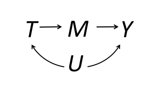

```{r setup, include=FALSE}
knitr::opts_chunk$set(echo = TRUE, eval=TRUE, warning=FALSE, message=FALSE)
```

# Today's plan
- Front-door criterion review
- Distributional effects in practice: quantile regression, distribution regression
- Multiple endpoints: indexes, p-value adjustment

# Front-door criterion


Setting: we want to estimate the effect of (binary) $T$ on $Y$, but it is confounded in the data. We have the (binary) mediator $M$ which *fully* mediates the effect of $T$.

Basic idea: under full mediation and unconfoundedness, the effect of $T$ on $Y$ is identified.

# Front-door criterion
Assumptions:

- No direct effect of $T$ on $Y$ (exclusion restriction)
  - $Y_i(t,m) = Y_i(1-t,m) \equiv Y_i(m)$
- Unconfoundedness
  - $M_i(y) \perp T_i$ for $t \in \{0,1\}$
  - $Y_i(m) \perp M_i(t) |T_i$ for $t \in \{0,1\}, m\in \{0,1\}$

These assumptions imply that the effect of $T$ on $M$ and of $M$ on $Y$ are identified. We can separately estimate them and multiply them to obtain the effect of $T$ on $Y$.

# Front-door criterion
In the lecture slides we have derived that

$$
\begin{aligned}
{\color{blue}ATT} = \underbrace{(Pr[M=1|T=1] - Pr[M=1|T=0])}_\text{Effect of T on M} \\ 
\times \underbrace{(E[Y_i|M_i=1, T_i={\color{blue}1}] - E[Y_i|M_i=0, T_i={\color{blue}1}])}_\text{Effect of M on Y among the treated}
\end{aligned}  
$$

and


$$
\begin{aligned}
{\color{red}ATC} = \underbrace{(Pr[M=1|T=1] - Pr[M=1|T=0])}_\text{Effect of T on M}   \\
\times \underbrace{(E[Y_i|M_i=1, T_i={\color{red}0}] - E[Y_i|M_i=0, T_i={\color{red}0}])}_\text{Effect of M on Y among the controls}
\end{aligned}
$$

# Front-door criterion
We can recover the ATE as the product of identified quantities.

$$
ATE = {\color{blue}ATT}\times Pr(T_i={\color{blue}1}) + {\color{red}ATC}\times Pr(T_i={\color{red}0})
$$
As the component quantities rely on selection on observables, we can estimate them using regression, matching or weighting.


# Front-door criterion: application

{height="78%"}


# Quantile regression
Rather than estimating the treatment effect on the conditional mean, estimates the treatment effect on conditional quantiles of the outcome variable.

Answers the question "how do different parts of the distribution change due to treatment?".

**Note**: results to be interpreted in terms of distribution moments, not of individual outcomes.


# Quantile regression in practice
To implement quantile regression:

- Stata: `qreg` and sister commands
  - `sqreg` and `bsqreg` for bootstrapped standard errors
- R: `quantreg`
  - Several methods available in the arguments, different SEs implemented through `summary`


# Working example
Our working example is the effect of military repression on support for democracy in the 1988 Chilean plebiscite.

{width=75%}


# Quantile regression in Stata
Estimation with `qreg`


# Quantile regression in Stata
Bootstrapping


# Quantile regression in R
\tiny
```{r}
library(quantreg); library(haven); library(dplyr); library(ggplot2)

# Import data
d <- read_dta("FinalDatasetForReplication.dta") 

# Prepare
d <- d %>% filter(MainSample == 1)

# Quantile regression
set.seed(10)
mod <- rq(VoteShareNo ~ DMilitaryPresence + share_allende70 + share_alessandri70 +
            lnDistStgo + lnDistRegCapital + Pop70_pthousands + sh_rural_70 + factor(IDProv),
          tau = c(0.25, 0.5, 0.75), data = d)

# Results (bootstrap SE)
est <- summary(mod, se = "boot")
out <- do.call("rbind", lapply(est, function(x) c(x$tau,
                                 x$coefficients["DMilitaryPresence",])))
out


```


# Distribution regression
Estimate how the outcome distribution changes by treatment condition. 

Differently from the quantile regression, we are estimating changes in density ("y-axis"), not in quantiles ("x-axis").

Straightforward idea:

- Create dummies for being below/above a certain value of the outcome distribution: $\mathbb{I}[y_i \geq y]$
- Use them as outcomes in separate regressions
- OLS coefficient interpretation: how much the share of units in that part of the support has been changed by the treatment
- With continuous treatment one can also use logit or probit


# Distribution regression
Characterize the changes in the distribution. From [Goodman-Bacon and Schmidt (2020)](http://goodman-bacon.com/pdfs/gbs_ssi.pdf):

{width="75%"}
\pause 

Let's do a similar exercise for the effect of repression on the Chilean plebiscite


# Distribution regression
\tiny
```{r, fig.align="center", fig.height=5}
ggplot(d, aes(x=VoteShareNo,  group=DMilitaryPresence, fill=factor(DMilitaryPresence))) + 
  geom_density(alpha=0.5) + 
  scale_fill_manual(values = c("grey", "blue"), name = "Military Presence", labels=c("No", "Yes")) +
  labs(x="% No") + theme_bw()
```

# Distribution regression

\tiny
```{r}
distr_reg <- function(i) {
  library(fixest); library(dplyr)
  d <- d %>% mutate(dum = case_when(VoteShareNo >= i ~ 1,
                                    VoteShareNo < i  ~ 0))
  fit <- feols(dum ~ DMilitaryPresence + share_allende70 + share_alessandri70 +
                   lnDistStgo + lnDistRegCapital + Pop70_pthousands + 
                   sh_rural_70 | IDProv, data = d, weights = ~Pop70, vcov = "hetero")
  coef <- coefficients(fit)["DMilitaryPresence"]
  ll <- confint(fit)["DMilitaryPresence", "2.5 %"]
  ul <- confint(fit)["DMilitaryPresence", "97.5 %"]
  
  cbind(i, coef, ll, ul)
}

out <- as.data.frame(do.call("rbind", lapply(as.list(seq(10, 70, 10)),
                                             function(x) distr_reg(x)))) 
```
 
 
# Distribution regression
\tiny
```{r, fig.align="center", fig.width=9, fig.height=4}
ggplot(out, aes(x=i, y = coef)) + geom_point() + geom_line() +
  geom_line(aes(x=i, y=ll), colour = "blue", linetype="dashed") +
  geom_line(aes(x=i, y=ul), colour = "blue", linetype="dashed") +
  geom_hline(yintercept=0, col="red", linetype = "dotted") +
  scale_x_continuous(breaks = seq(10,70,10)) + labs(x="% No", y="Effect") + theme_bw()
```


# Multiple endpoints
Testing multiple hypotheses increases the possibility of \textcolor{red}{type I} or \textcolor{blue}{type II} error, i.e. false \textcolor{red}{Positives} or false \textcolor{blue}{Negatives}.

But many times we do want to test multiple hypotheses (several behavioral outcomes in field experiments, votes for different paties in the same family/multiple elections etc)

Some popular strategies:

- Summarize different measures in a single one
- Adjust p-values for multiple comparisons


# Principal Component Analysis
Reduces dimensionality of the outcomes by extracting shared variation along different dimensions.

Returns estimates of "principal components" which are orthogonal to each other.

We can use the principal components score (usually the first one) of the outcomes as a single outcome that "summarizes" the shared variation.

- Stata: `pca`
- R: `prcomp`, `princomp`


# Principal Component Analysis
\tiny
```{r}
vars <- c("Share_reg70_w2", "VoteShareNo", "VoteShareNo_pop70")
pca <- prcomp(d[,vars], center=T, scale=T)
pca
```

# Screeplot
\tiny
```{r, fig.align="center", fig.height=5}
data.frame(number=c(1:3), Eigenvalues = (pca$sdev)^2) %>% 
  ggplot(aes(x=number, y=Eigenvalues)) + geom_point() + geom_line() + theme_bw()
```


# Principal Component Analysis
We can also pass the PCA output through the nice package `factoextra`. \pause

\tiny
```{r, fig.align="center", fig.height=5}
library(factoextra)
fviz_eig(pca, choice = "eigenvalue")
```

# Principal Component Analysis
The first factor can be used as outcome in the regression.

Note that factors are estimates. To make correct inference we should bootstrap the procedure to incorporate their uncertainty in that of the treatment effect.

Sample code for R and Stata in this week's folder.


# Inverse Covariance Weighting

Cyrus provides [Stata and R code](https://github.com/cdsamii/make_index) for computing ICW indexes

# p-value adjustment
Most standard p-value adjustment methods implemented in base R through `p.adjust`.

\tiny
```{r}
# Generate p-values from different tests
set.seed(1)
p <- sort(runif(10, 0.03, 0.07))
d <- data.frame(p = p, 
                bonferroni = p.adjust(p, method = "bonferroni"))
d
```

# Implementing p-value adjustments
Several adjustment options in Stata user-written packages, summarized by [David McKenzie](https://blogs.worldbank.org/impactevaluations/updated-overview-multiple-hypothesis-testing-commands-stata)

Sample Stata data and code from McKenzie are posted in this week's GitHub folder.

In R there appear to be less resources.

